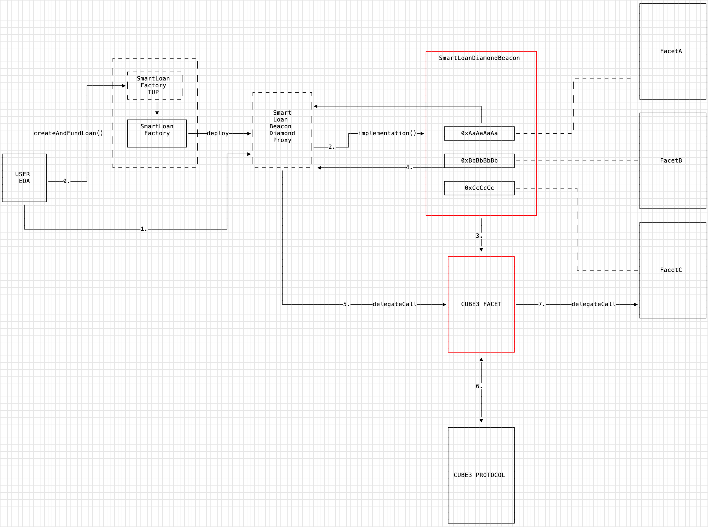
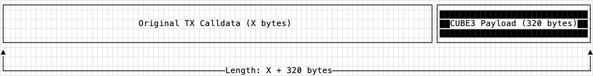
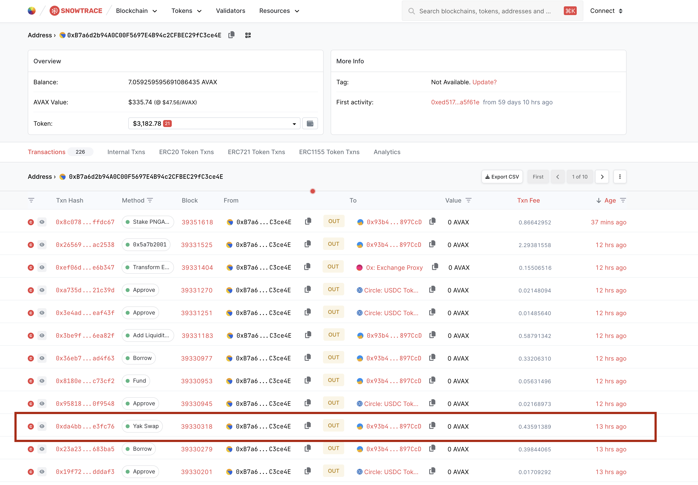

# CUBE3 POC

This document outlines a proof-of-concept integration between DeltaPrime and CUBE3. The integration is based on the following assumptions:

- The CUBE3 Protocol is deployed on Avalanche
- DeltaPrime subscribes to the CUBE3 RASP Validation API
- The SmartLoanDiamondBeacon can be upgraded
- DeltaPrime users interact with their Smart Loan accounts via the DeltaPrime UI, which has access to the CUBE3 Risk API
- Users on Avalanche are not sensitive to the nominal increase to a transaction's gas cost.
- Modifications/Additions to contract code are for the development of a proof-of-concept only and are not ready for a production environment.
- Any/all potential modifications/additions to contract code are subject to a security audit.

## How it works

Slight modifications are made to the `SmartLoanDiamondBeacon.sol`:

- The addition of constant address variables for the `CUBE3_ROUTER` and `CUBE3_FACET`. These could be added to the `DiamondStorageLib` as an alternative.
- A `getFacet(bytes4 sig)` utility function has been added (which operates differently to `implementation(bytes4 signature)`).
- `implementation(bytes4 signature)` has been modified to return the `CUBE3_FACET` address if the function being called is registered for protection with the CUBE3 protocol.

The `Cube3Facet.sol` contract has been introduced. The facet's primary responsibility is to send the transaction's calldata to the CUBE3 Router for validation. This means that for function's that are protected, the `Cube3SecurePayload` needs to be added to the function's calldata. This payload is evaluated by the `Cube3Router` and if the transaction is deemed to be safe, the `Cube3Router` will successfully return to the `Cube3Facet`, that will then execute the function call for the original facet. See the diagram below for an explanation.



Before a Smart Loan account can interact with the CUBE3 Protocol, it needs to be registered, which can be done by calling the functions on the `Cube3Facet` directly.

Consider the following scenario:

- User wants to call `FunctionA` (with function signature `0xAaAaAaAa`) belonging to `FacetA`, which is a function protected by the CUBE3 protocol.
- Before submitting the transaction onchain, the DeltaPrime dApp will call the CUBE3 Risk API to determine the risk of the transaction. If it is safe, the Risk API will provide at `320 byte` payload containing the function's calldata and a `signature` signed by the user's generated signing authority (A private key stored in the CUBE3 KMS). When the transaction is submitted onchain, the payload data is packed together at the end of the original calldata, adding and additional `320 bytes` to the transaction's original calldata.



- The user submits the transaction onchain, which is received by their `SmartLoanDiamonBeaconProxy` account. The `implementation(0xAaAaAaAa)` staticcall is made to the Beacon, which returns the `CUBE3_FACET` address, because the call to the `CUBE3_ROUTER` returns `true`, indicating that this function is protected and the transaction needs to be validated.
- The `SmartyLoanDiamonBeaconProxy` then delegatecalls to the `Cube3Facet`. Inside the facet's callback, the original calldata, along with the `Cube3SecurePayload` is sent to the `Cube3Router` for validation. If it succeeds, the `Cube3Router` returns successfully to the `Cube3Facet`. If it fails, the transaction is reverted.
- Once the transaction has successfully executed the validation via the `Cube3Router`, the `320 bytes` payload is removed from the original calldata and the `Cube3Facet` then delegatecalls to the `FacetA` to execute the original function call.

In essence, the `Cube3Facet` acts as a piece of middleware between the caller and the original facet, but only for functions that are protected by the CUBE3 protocol. The `Cube3Facet` is also responsible for registering Smart Loan accounts with the CUBE3 protocol.

## Testing

Tests were conducted using the foundry development toolkit, along with an Avalanche archive node and a local fork of the Avalanche network at a specific block height. Testing methodology was as follows:

- Identify an onchain transaction that can be simulated locally
- Create a local Avalanche fork 1 block before the TX
- Deploy the CUBE3 protocol to the fork
- Configure the protocol contracts
- Create signing authority for the Smart Loan and install in the registry
- Deploy the CUBE3 Facet (prank the Delta Prime deployer)
- Replace the bytecode of the SmartLoanDiamondBeacon with the modified version (In a real-world scenario, a new beacon would be deployed and proxies would be upgraded)
- Add the CUBE3 Facet to the DeltaPrime protocol using `diamondCut` (prank the Delta Prime Timelock)
- Register the integration (by calling the CUBE3 Facet as the Smart Loan owner)
- Enable Function protection for the YakSwap function selector
- Execute the transaction 1 block before

The following transaction was identified that utilizes the `YieldYakFacet`:



[Snowtrace](https://snowtrace.io/tx/0xda4bb605d5f9cb71454b35f4773872f87609699aaf1e658fd8e1af00dce3fc76?chainId=43114)

[Tenderly](https://www.tdly.co/tx/43114/0x8b88e9005924fcd2a4f6835b5c4065e3d0c6f9ae579d96d369372262217346d2)

The following test was executed:

```typescript

// YakSwap
// function yakSwap(uint256 _amountIn, uint256 _amountOut, address[] calldata _path, address[] calldata _adapters) external;
// _amountIn 2958513218
// _amountOut 65000000000000000000
// _path ["0xb97ef9ef8734c71904d8002f8b6bc66dd9c48a6e","0xb31f66aa3c1e785363f0875a1b74e27b85fd66c7"]
// _adapters 0x3614657edc3cb90ba420e5f4f61679777e4974e3
// forge test --match-test testYakSwap -vvvv
function testYakSwap() public withCUBE3 {

    emit log_named_uint("block", block.number);

    bytes memory yakSwapCalldata = hex"1f7f8b2700000000000000000000000000000000000000000000000000000000b0575442000000000000000000000000000000000000000000000003860e639d80640000000000000000000000000000000000000000000000000000000000000000008000000000000000000000000000000000000000000000000000000000000000e00000000000000000000000000000000000000000000000000000000000000002000000000000000000000000b97ef9ef8734c71904d8002f8b6bc66dd9c48a6e000000000000000000000000b31f66aa3c1e785363f0875a1b74e27b85fd66c700000000000000000000000000000000000000000000000000000000000000010000000000000000000000003614657edc3cb90ba420e5f4f61679777e4974e355534443000000000000000000000000000000000000000000000000000000000000000000000000000000000000000000000000000000000000000005f5dd18018c8c7afe800000002000000121be435ee35d2bc2c82158694b1393e6e6c0c0a60282e57443211387bc0cc93a5cd51cb52378ae0c9a41d20057f695f8c3a8d8c4b3e11c23e35682331cb5ef111b55534443000000000000000000000000000000000000000000000000000000000000000000000000000000000000000000000000000000000000000005f5dd18018c8c7afe8000000020000001a1300aecb37f01ac0f0c42d770a5aa60634e2a20f50537d796ec372875e2b2621043a7ff447864ce999a2f565b657b0399bdd84bfb74c78a74357147dfdd9ad41c55534443000000000000000000000000000000000000000000000000000000000000000000000000000000000000000000000000000000000000000005f5dd18018c8c7afe80000000200000015546d7ff3436972e8d25e3b2c18002d95511c54e8687a9e9efcb55171ee19bb43dd3b3769458de9fd208cb8fbd12ddd7363ab8814f604d72f4e5fc7ec8fb7c561b4156415800000000000000000000000000000000000000000000000000000000000000000000000000000000000000000000000000000000000000010bb4b423018c8c7afe80000000200000016a9e0b7701b4d9f722a925d5491ac4250c579dd7a123036520e3f5fe3ccf4ca87e3ae526b786b29714608fb0ce358d0e7196d2a34b3d99eda0ac66b3ff3a91ff1c4156415800000000000000000000000000000000000000000000000000000000000000000000000000000000000000000000000000000000000000010b99dc00018c8c7afe8000000020000001e795cc34b9c40ea77ebd5f03e78a450c9b0041462f6d1c00c10bbfdfba298e9f6ee5e89a1fd3143e064342adb521a34082c076fe0eebf1837b764051d2774d9e1c4156415800000000000000000000000000000000000000000000000000000000000000000000000000000000000000000000000000000000000000010b99dc00018c8c7afe800000002000000101d93a160103d069c4e0573403c05b26bf7ef6f771c24db3d7651aade525077e3fc8ad10c7f597437a623ef0e290fa5911a84c8ef675cbbe64d77ba0ad3b012c1c55534454000000000000000000000000000000000000000000000000000000000000000000000000000000000000000000000000000000000000000005f60d75018c8c7afe8000000020000001074ca0b59720eecb6ce2febb7305f14e5734af18f437fc09e1547e9fe6b393af459d66d7ffa84fd0a8c5f1ac233932c78fa498698cdb65989b662a3e435f8be31c55534454000000000000000000000000000000000000000000000000000000000000000000000000000000000000000000000000000000000000000005f60d75018c8c7afe80000000200000010307835ad4a0182ee436c05762d18b340750922e9031a2f8768d1d5a29045181192f84eb0119c59693eb8c2083443f0ef60cc49b75d15cf6876c176219d51c631c55534454000000000000000000000000000000000000000000000000000000000000000000000000000000000000000000000000000000000000000005f60d75018c8c7afe8000000020000001b62274982bbdb83b1206e91552ed5ebe918059f48c5884309a51bda833e02f63776037547d222e3320dce9085deabd82cc88e086ed7a9dc127aa8a9d81858d671b4254430000000000000000000000000000000000000000000000000000000000000000000000000000000000000000000000000000000000000003ffff2ecfc0018c8c7afe800000002000000175c424633f89e0e58d0efb46f95825e161244c34685b38e4c72b6c80ee12265a1dae2536d7f066d6f054808a7d4d33fde6de2f8af0ec5fd0118f1c6ce48d32b51c4254430000000000000000000000000000000000000000000000000000000000000000000000000000000000000000000000000000000000000003fff6e5ab90018c8c7afe8000000020000001844b7fd93c0ae326780ceb76086d241efac28a73c99b12ecaf3e194a5699763c5fd90ee54cd7aace36393ed281aa951761c1706b8335bc86be0414c056f6a0e81c4254430000000000000000000000000000000000000000000000000000000000000000000000000000000000000000000000000000000000000003fff6e5ab90018c8c7afe80000000200000014c0b68c631c21caef058a32b91bbceca6cacb36e0586365860b4abc41f0cc9fe44871890082320d84699247c1d9ca3dadcb8cfdfc363e331240ee2aef5e2f27d1b45544800000000000000000000000000000000000000000000000000000000000000000000000000000000000000000000000000000000000000003477babb03018c8c7afe8000000020000001902494cd3cc4bfa48b70088ff03a46d595d025f64e39705b06f10f59b8ac51242c66d6352d33e09594311c508474c88ac1151d7dd124b93dfc2f58c3383343b41c45544800000000000000000000000000000000000000000000000000000000000000000000000000000000000000000000000000000000000000003477babb03018c8c7afe8000000020000001e161bd114bcfd053d85f1a19cfd082d0d9ef4ede9085b06e75de9eefddbb33640c7f39ca0ddbd2806ce17a390d6d5d96ca8ffaab1df25a513f51a819384f8da31b45544800000000000000000000000000000000000000000000000000000000000000000000000000000000000000000000000000000000000000003477babb03018c8c7afe80000000200000015bb21359dccc1bfc51cf954054c097e01b917cabebbbc5bdf1e82e851a851e7f0a68906676179abf312ed56223cbfc24fcc0342d1a311e40e56598c49abc5eb31b000f3137303331363339363530303723302e322e352372656473746f6e652d6176616c616e6368652d70726f6400002b000002ed57011e0000";
    bytes memory emptyBytes = new bytes(320); // payload length
    bytes memory swapCalldataWithEmptyPayload = (abi.encodePacked(yakSwapCalldata, emptyBytes));

    bytes memory cube3SecurePayload = _createPayload(
        smartLoan,
        owner,
        swapCalldataWithEmptyPayload,
        signerPvtKey,
        1 days,
        0,
        signatureModule
    );

    vm.startPrank(owner);
    (bool success, bytes memory result) = smartLoan.call(abi.encodePacked(yakSwapCalldata, cube3SecurePayload));
     require(success, "packed calldata call failed");
    vm.stopPrank();
}
```

The stacktrace showing the successful interaction with the CUBE3 protocol is as follows:

```bash
Running 1 test for test/foundry/DeltaDemo.t.sol:ForkedDeploymentTest
 [PASS]   testYakSwap() (gas: 1948832)
Logs:
  Adding facet
  generating reg sig
  registrationSignature: 0x2bbb6c12b2103649c8f6925c93b84d4e544c5ce28e1af82337b890d9ab9a29e923f5c7fc0b727011339bfb086586450aeaf7fa924db27647fbcd4c39d88a6d021b
  generating reg sig
  registrationSignature: 0xa6562b0e1726a13188ba3cd444d68b826fcf4022d676c425255014d91f49ee0018cf0c957c68ee1fbb3c7af0d6cd71efd53364a39dfc0a931c633055439288691c
  finished cube3
  block: 39330317

Traces:
  [1948832]  ForkedDeploymentTest  :: testYakSwap  ()
    ├─ emit       log_string  (val: "finished cube3")
    ├─ emit       log_named_uint  (key: "block", val: 39330317    2;49;39m[3.933e7]  )
    ├─ [218]  Cube3SignatureModule  :: moduleId  ()       [staticcall]
    │   └─  ←   0x8627ac9f51cee3e9224e0f4644a33be4bb7c6f18430f8edd8942642e3ea5ebb8
    ├─ [0]    34mVM  ::   34msign  (666, 0xc727fc56e5a442a19368a663be685710006d15c28eafb9603e695023835661b3)       [staticcall]
    │   └─    34m←   27, 0x7ac5d718d6e5438db712f4d324dbae5d855a524baea2153ec31977b4a9c3e146, 0x5be7dc2c5915ef2d1941625c3fae517b8a23ec378fc73a07400bcc714f9102dc
    ├─ [3000]  PRECOMPILES  :: ecrecover  (0xc727fc56e5a442a19368a663be685710006d15c28eafb9603e695023835661b3, 27, 55531720944054265184690260337470555742087477543882987679613798002177266147654, 41570130472856812599476569630985420705268048446150547668123378466352798958300)       [staticcall]
    │   └─  ←   0x0000000000000000000000001cc0c65ca5dd6b767338946f2c44c02040744ef5
    ├─ [0]    34mVM  ::   34maddr  (666)       [staticcall]
    │   └─    34m←   0x1Cc0C65Ca5dD6B767338946f2c44C02040744ef5
    ├─ [0]    34mVM  ::   34mstartPrank  (0xB7a6d2b94A0C00F5697E4B94c2CFBEC29fC3ce4E)
    │   └─    34m←   ()

    #### ================ Initial Call implementation() ================== ####

    ├─ [953746]  0x93b4A02eD768D38e91E6a668C13a578b3a897CcD  :: yakSwap  (2958513218    2;49;39m[2.958e9]  , 65000000000000000000    2;49;39m[6.5e19]  , [0xB97EF9Ef8734C71904D8002F8b6Bc66Dd9c48a6E, 0xB31f66AA3C1e785363F0875A1B74E27b85FD66c7], [0x3614657EDc3cb90BA420E5f4F61679777e4974E3])
    │   ├─ [13291]  0x2916B3bf7C35bd21e63D01C93C62FB0d4994e56D  :: implementation  (0x1f7f8b2700000000000000000000000000000000000000000000000000000000)       [staticcall]
    │   │   ├─ [7718]  CubeRouterProxy  :: getIntegrationFnProtectionStatus  (0x93b4A02eD768D38e91E6a668C13a578b3a897CcD, 0x1f7f8b2700000000000000000000000000000000000000000000000000000000)       [staticcall]
    │   │   │   ├─ [2829]  Cube3RouterImpl  :: getIntegrationFnProtectionStatus  (0x93b4A02eD768D38e91E6a668C13a578b3a897CcD, 0x1f7f8b2700000000000000000000000000000000000000000000000000000000)       [delegatecall]
    │   │   │   │   └─  ←   true
    │   │   │   └─  ←   true
    │   │   └─  ←   Cube3Facet: [0x33576C540de58b030A530A2c49CcE0363Ed2f83e]
    │   ├─ [931694]  Cube3Facet  :: yakSwap  (2958513218    2;49;39m[2.958e9]  , 65000000000000000000    2;49;39m[6.5e19]  , [0xB97EF9Ef8734C71904D8002F8b6Bc66Dd9c48a6E, 0xB31f66AA3C1e785363F0875A1B74E27b85FD66c7], [0x3614657EDc3cb90BA420E5f4F61679777e4974E3])       [delegatecall]
    │   │   ├─ emit       LogSender  (s: 0xB7a6d2b94A0C00F5697E4B94c2CFBEC29fC3ce4E)
    │   │   ├─ emit       LogFacet  (f: 0x93b4A02eD768D38e91E6a668C13a578b3a897CcD)
    │   │   ├─ [2617]  0x2916B3bf7C35bd21e63D01C93C62FB0d4994e56D  :: getFacet  (0x1f7f8b2700000000000000000000000000000000000000000000000000000000)       [staticcall]
    │   │   │   └─  ←   0x038EF81897e0deA59B426c827B5d38cac0CB1143
    │   │   ├─ emit       LogFacet  (f: 0x038EF81897e0deA59B426c827B5d38cac0CB1143)


     #### ================ Routing TX data to the CUBE3 Protocol ================== ####

    │   │   ├─ [38935]  CubeRouterProxy  :: routeToModule  (0xB7a6d2b94A0C00F5697E4B94c2CFBEC29fC3ce4E, 0, 320, 0x1f7f8b2700000000000000000000000000000000000000000000000000000000b0575442000000000000000000000000000000000000000000000003860e639d80640000000000000000000000000000000000000000000000000000000000000000008000000000000000000000000000000000000000000000000000000000000000e00000000000000000000000000000000000000000000000000000000000000002000000000000000000000000b97ef9ef8734c71904d8002f8b6bc66dd9c48a6e000000000000000000000000b31f66aa3c1e785363f0875a1b74e27b85fd66c700000000000000000000000000000000000000000000000000000000000000010000000000000000000000003614657edc3cb90ba420e5f4f61679777e4974e355534443000000000000000000000000000000000000000000000000000000000000000000000000000000000000000000000000000000000000000005f5dd18018c8c7afe800000002000000121be435ee35d2bc2c82158694b1393e6e6c0c0a60282e57443211387bc0cc93a5cd51cb52378ae0c9a41d20057f695f8c3a8d8c4b3e11c23e35682331cb5ef111b55534443000000000000000000000000000000000000000000000000000000000000000000000000000000000000000000000000000000000000000005f5dd18018c8c7afe8000000020000001a1300aecb37f01ac0f0c42d770a5aa60634e2a20f50537d796ec372875e2b2621043a7ff447864ce999a2f565b657b0399bdd84bfb74c78a74357147dfdd9ad41c55534443000000000000000000000000000000000000000000000000000000000000000000000000000000000000000000000000000000000000000005f5dd18018c8c7afe80000000200000015546d7ff3436972e8d25e3b2c18002d95511c54e8687a9e9efcb55171ee19bb43dd3b3769458de9fd208cb8fbd12ddd7363ab8814f604d72f4e5fc7ec8fb7c561b4156415800000000000000000000000000000000000000000000000000000000000000000000000000000000000000000000000000000000000000010bb4b423018c8c7afe80000000200000016a9e0b7701b4d9f722a925d5491ac4250c579dd7a123036520e3f5fe3ccf4ca87e3ae526b786b29714608fb0ce358d0e7196d2a34b3d99eda0ac66b3ff3a91ff1c4156415800000000000000000000000000000000000000000000000000000000000000000000000000000000000000000000000000000000000000010b99dc00018c8c7afe8000000020000001e795cc34b9c40ea77ebd5f03e78a450c9b0041462f6d1c00c10bbfdfba298e9f6ee5e89a1fd3143e064342adb521a34082c076fe0eebf1837b764051d2774d9e1c4156415800000000000000000000000000000000000000000000000000000000000000000000000000000000000000000000000000000000000000010b99dc00018c8c7afe800000002000000101d93a160103d069c4e0573403c05b26bf7ef6f771c24db3d7651aade525077e3fc8ad10c7f597437a623ef0e290fa5911a84c8ef675cbbe64d77ba0ad3b012c1c55534454000000000000000000000000000000000000000000000000000000000000000000000000000000000000000000000000000000000000000005f60d75018c8c7afe8000000020000001074ca0b59720eecb6ce2febb7305f14e5734af18f437fc09e1547e9fe6b393af459d66d7ffa84fd0a8c5f1ac233932c78fa498698cdb65989b662a3e435f8be31c55534454000000000000000000000000000000000000000000000000000000000000000000000000000000000000000000000000000000000000000005f60d75018c8c7afe80000000200000010307835ad4a0182ee436c05762d18b340750922e9031a2f8768d1d5a29045181192f84eb0119c59693eb8c2083443f0ef60cc49b75d15cf6876c176219d51c631c55534454000000000000000000000000000000000000000000000000000000000000000000000000000000000000000000000000000000000000000005f60d75018c8c7afe8000000020000001b62274982bbdb83b1206e91552ed5ebe918059f48c5884309a51bda833e02f63776037547d222e3320dce9085deabd82cc88e086ed7a9dc127aa8a9d81858d671b4254430000000000000000000000000000000000000000000000000000000000000000000000000000000000000000000000000000000000000003ffff2ecfc0018c8c7afe800000002000000175c424633f89e0e58d0efb46f95825e161244c34685b38e4c72b6c80ee12265a1dae2536d7f066d6f054808a7d4d33fde6de2f8af0ec5fd0118f1c6ce48d32b51c4254430000000000000000000000000000000000000000000000000000000000000000000000000000000000000000000000000000000000000003fff6e5ab90018c8c7afe8000000020000001844b7fd93c0ae326780ceb76086d241efac28a73c99b12ecaf3e194a5699763c5fd90ee54cd7aace36393ed281aa951761c1706b8335bc86be0414c056f6a0e81c4254430000000000000000000000000000000000000000000000000000000000000000000000000000000000000000000000000000000000000003fff6e5ab90018c8c7afe80000000200000014c0b68c631c21caef058a32b91bbceca6cacb36e0586365860b4abc41f0cc9fe44871890082320d84699247c1d9ca3dadcb8cfdfc363e331240ee2aef5e2f27d1b45544800000000000000000000000000000000000000000000000000000000000000000000000000000000000000000000000000000000000000003477babb03018c8c7afe8000000020000001902494cd3cc4bfa48b70088ff03a46d595d025f64e39705b06f10f59b8ac51242c66d6352d33e09594311c508474c88ac1151d7dd124b93dfc2f58c3383343b41c45544800000000000000000000000000000000000000000000000000000000000000000000000000000000000000000000000000000000000000003477babb03018c8c7afe8000000020000001e161bd114bcfd053d85f1a19cfd082d0d9ef4ede9085b06e75de9eefddbb33640c7f39ca0ddbd2806ce17a390d6d5d96ca8ffaab1df25a513f51a819384f8da31b45544800000000000000000000000000000000000000000000000000000000000000000000000000000000000000000000000000000000000000003477babb03018c8c7afe80000000200000015bb21359dccc1bfc51cf954054c097e01b917cabebbbc5bdf1e82e851a851e7f0a68906676179abf312ed56223cbfc24fcc0342d1a311e40e56598c49abc5eb31b000f3137303331363339363530303723302e322e352372656473746f6e652d6176616c616e6368652d70726f6400002b000002ed57011e0000d90b2a0a000000000000000000000000000000000000000000000000000000008627ac9f51cee3e9224e0f4644a33be4bb7c6f18430f8edd8942642e3ea5ebb80000000000000000000000000000000000000000000000000000000065858a060000000000000000000000000000000000000000000000000000000000000000000000000000000000000000000000000000000000000000000000000000000000000000000000000000000000000000000000000000000000000000000000c000000000000000000000000000000000000000000000000000000000000000417ac5d718d6e5438db712f4d324dbae5d855a524baea2153ec31977b4a9c3e1465be7dc2c5915ef2d1941625c3fae517b8a23ec378fc73a07400bcc714f9102dc1b00000000000000000000000000000000000000000000000000000000000000)
    │   │   │   ├─ [37983]  Cube3RouterImpl  :: routeToModule  (0xB7a6d2b94A0C00F5697E4B94c2CFBEC29fC3ce4E, 0, 320, 0x1f7f8b2700000000000000000000000000000000000000000000000000000000b0575442000000000000000000000000000000000000000000000003860e639d80640000000000000000000000000000000000000000000000000000000000000000008000000000000000000000000000000000000000000000000000000000000000e00000000000000000000000000000000000000000000000000000000000000002000000000000000000000000b97ef9ef8734c71904d8002f8b6bc66dd9c48a6e000000000000000000000000b31f66aa3c1e785363f0875a1b74e27b85fd66c700000000000000000000000000000000000000000000000000000000000000010000000000000000000000003614657edc3cb90ba420e5f4f61679777e4974e355534443000000000000000000000000000000000000000000000000000000000000000000000000000000000000000000000000000000000000000005f5dd18018c8c7afe800000002000000121be435ee35d2bc2c82158694b1393e6e6c0c0a60282e57443211387bc0cc93a5cd51cb52378ae0c9a41d20057f695f8c3a8d8c4b3e11c23e35682331cb5ef111b55534443000000000000000000000000000000000000000000000000000000000000000000000000000000000000000000000000000000000000000005f5dd18018c8c7afe8000000020000001a1300aecb37f01ac0f0c42d770a5aa60634e2a20f50537d796ec372875e2b2621043a7ff447864ce999a2f565b657b0399bdd84bfb74c78a74357147dfdd9ad41c55534443000000000000000000000000000000000000000000000000000000000000000000000000000000000000000000000000000000000000000005f5dd18018c8c7afe80000000200000015546d7ff3436972e8d25e3b2c18002d95511c54e8687a9e9efcb55171ee19bb43dd3b3769458de9fd208cb8fbd12ddd7363ab8814f604d72f4e5fc7ec8fb7c561b4156415800000000000000000000000000000000000000000000000000000000000000000000000000000000000000000000000000000000000000010bb4b423018c8c7afe80000000200000016a9e0b7701b4d9f722a925d5491ac4250c579dd7a123036520e3f5fe3ccf4ca87e3ae526b786b29714608fb0ce358d0e7196d2a34b3d99eda0ac66b3ff3a91ff1c4156415800000000000000000000000000000000000000000000000000000000000000000000000000000000000000000000000000000000000000010b99dc00018c8c7afe8000000020000001e795cc34b9c40ea77ebd5f03e78a450c9b0041462f6d1c00c10bbfdfba298e9f6ee5e89a1fd3143e064342adb521a34082c076fe0eebf1837b764051d2774d9e1c4156415800000000000000000000000000000000000000000000000000000000000000000000000000000000000000000000000000000000000000010b99dc00018c8c7afe800000002000000101d93a160103d069c4e0573403c05b26bf7ef6f771c24db3d7651aade525077e3fc8ad10c7f597437a623ef0e290fa5911a84c8ef675cbbe64d77ba0ad3b012c1c55534454000000000000000000000000000000000000000000000000000000000000000000000000000000000000000000000000000000000000000005f60d75018c8c7afe8000000020000001074ca0b59720eecb6ce2febb7305f14e5734af18f437fc09e1547e9fe6b393af459d66d7ffa84fd0a8c5f1ac233932c78fa498698cdb65989b662a3e435f8be31c55534454000000000000000000000000000000000000000000000000000000000000000000000000000000000000000000000000000000000000000005f60d75018c8c7afe80000000200000010307835ad4a0182ee436c05762d18b340750922e9031a2f8768d1d5a29045181192f84eb0119c59693eb8c2083443f0ef60cc49b75d15cf6876c176219d51c631c55534454000000000000000000000000000000000000000000000000000000000000000000000000000000000000000000000000000000000000000005f60d75018c8c7afe8000000020000001b62274982bbdb83b1206e91552ed5ebe918059f48c5884309a51bda833e02f63776037547d222e3320dce9085deabd82cc88e086ed7a9dc127aa8a9d81858d671b4254430000000000000000000000000000000000000000000000000000000000000000000000000000000000000000000000000000000000000003ffff2ecfc0018c8c7afe800000002000000175c424633f89e0e58d0efb46f95825e161244c34685b38e4c72b6c80ee12265a1dae2536d7f066d6f054808a7d4d33fde6de2f8af0ec5fd0118f1c6ce48d32b51c4254430000000000000000000000000000000000000000000000000000000000000000000000000000000000000000000000000000000000000003fff6e5ab90018c8c7afe8000000020000001844b7fd93c0ae326780ceb76086d241efac28a73c99b12ecaf3e194a5699763c5fd90ee54cd7aace36393ed281aa951761c1706b8335bc86be0414c056f6a0e81c4254430000000000000000000000000000000000000000000000000000000000000000000000000000000000000000000000000000000000000003fff6e5ab90018c8c7afe80000000200000014c0b68c631c21caef058a32b91bbceca6cacb36e0586365860b4abc41f0cc9fe44871890082320d84699247c1d9ca3dadcb8cfdfc363e331240ee2aef5e2f27d1b45544800000000000000000000000000000000000000000000000000000000000000000000000000000000000000000000000000000000000000003477babb03018c8c7afe8000000020000001902494cd3cc4bfa48b70088ff03a46d595d025f64e39705b06f10f59b8ac51242c66d6352d33e09594311c508474c88ac1151d7dd124b93dfc2f58c3383343b41c45544800000000000000000000000000000000000000000000000000000000000000000000000000000000000000000000000000000000000000003477babb03018c8c7afe8000000020000001e161bd114bcfd053d85f1a19cfd082d0d9ef4ede9085b06e75de9eefddbb33640c7f39ca0ddbd2806ce17a390d6d5d96ca8ffaab1df25a513f51a819384f8da31b45544800000000000000000000000000000000000000000000000000000000000000000000000000000000000000000000000000000000000000003477babb03018c8c7afe80000000200000015bb21359dccc1bfc51cf954054c097e01b917cabebbbc5bdf1e82e851a851e7f0a68906676179abf312ed56223cbfc24fcc0342d1a311e40e56598c49abc5eb31b000f3137303331363339363530303723302e322e352372656473746f6e652d6176616c616e6368652d70726f6400002b000002ed57011e0000d90b2a0a000000000000000000000000000000000000000000000000000000008627ac9f51cee3e9224e0f4644a33be4bb7c6f18430f8edd8942642e3ea5ebb80000000000000000000000000000000000000000000000000000000065858a060000000000000000000000000000000000000000000000000000000000000000000000000000000000000000000000000000000000000000000000000000000000000000000000000000000000000000000000000000000000000000000000c000000000000000000000000000000000000000000000000000000000000000417ac5d718d6e5438db712f4d324dbae5d855a524baea2153ec31977b4a9c3e1465be7dc2c5915ef2d1941625c3fae517b8a23ec378fc73a07400bcc714f9102dc1b00000000000000000000000000000000000000000000000000000000000000)       [delegatecall]
    │   │   │   │   ├─ [16046]  Cube3SignatureModule  :: validateSignature  (0xB7a6d2b94A0C00F5697E4B94c2CFBEC29fC3ce4E, 0x93b4A02eD768D38e91E6a668C13a578b3a897CcD, 0, 0x1f7f8b2700000000000000000000000000000000000000000000000000000000b0575442000000000000000000000000000000000000000000000003860e639d80640000000000000000000000000000000000000000000000000000000000000000008000000000000000000000000000000000000000000000000000000000000000e00000000000000000000000000000000000000000000000000000000000000002000000000000000000000000b97ef9ef8734c71904d8002f8b6bc66dd9c48a6e000000000000000000000000b31f66aa3c1e785363f0875a1b74e27b85fd66c700000000000000000000000000000000000000000000000000000000000000010000000000000000000000003614657edc3cb90ba420e5f4f61679777e4974e355534443000000000000000000000000000000000000000000000000000000000000000000000000000000000000000000000000000000000000000005f5dd18018c8c7afe800000002000000121be435ee35d2bc2c82158694b1393e6e6c0c0a60282e57443211387bc0cc93a5cd51cb52378ae0c9a41d20057f695f8c3a8d8c4b3e11c23e35682331cb5ef111b55534443000000000000000000000000000000000000000000000000000000000000000000000000000000000000000000000000000000000000000005f5dd18018c8c7afe8000000020000001a1300aecb37f01ac0f0c42d770a5aa60634e2a20f50537d796ec372875e2b2621043a7ff447864ce999a2f565b657b0399bdd84bfb74c78a74357147dfdd9ad41c55534443000000000000000000000000000000000000000000000000000000000000000000000000000000000000000000000000000000000000000005f5dd18018c8c7afe80000000200000015546d7ff3436972e8d25e3b2c18002d95511c54e8687a9e9efcb55171ee19bb43dd3b3769458de9fd208cb8fbd12ddd7363ab8814f604d72f4e5fc7ec8fb7c561b4156415800000000000000000000000000000000000000000000000000000000000000000000000000000000000000000000000000000000000000010bb4b423018c8c7afe80000000200000016a9e0b7701b4d9f722a925d5491ac4250c579dd7a123036520e3f5fe3ccf4ca87e3ae526b786b29714608fb0ce358d0e7196d2a34b3d99eda0ac66b3ff3a91ff1c4156415800000000000000000000000000000000000000000000000000000000000000000000000000000000000000000000000000000000000000010b99dc00018c8c7afe8000000020000001e795cc34b9c40ea77ebd5f03e78a450c9b0041462f6d1c00c10bbfdfba298e9f6ee5e89a1fd3143e064342adb521a34082c076fe0eebf1837b764051d2774d9e1c4156415800000000000000000000000000000000000000000000000000000000000000000000000000000000000000000000000000000000000000010b99dc00018c8c7afe800000002000000101d93a160103d069c4e0573403c05b26bf7ef6f771c24db3d7651aade525077e3fc8ad10c7f597437a623ef0e290fa5911a84c8ef675cbbe64d77ba0ad3b012c1c55534454000000000000000000000000000000000000000000000000000000000000000000000000000000000000000000000000000000000000000005f60d75018c8c7afe8000000020000001074ca0b59720eecb6ce2febb7305f14e5734af18f437fc09e1547e9fe6b393af459d66d7ffa84fd0a8c5f1ac233932c78fa498698cdb65989b662a3e435f8be31c55534454000000000000000000000000000000000000000000000000000000000000000000000000000000000000000000000000000000000000000005f60d75018c8c7afe80000000200000010307835ad4a0182ee436c05762d18b340750922e9031a2f8768d1d5a29045181192f84eb0119c59693eb8c2083443f0ef60cc49b75d15cf6876c176219d51c631c55534454000000000000000000000000000000000000000000000000000000000000000000000000000000000000000000000000000000000000000005f60d75018c8c7afe8000000020000001b62274982bbdb83b1206e91552ed5ebe918059f48c5884309a51bda833e02f63776037547d222e3320dce9085deabd82cc88e086ed7a9dc127aa8a9d81858d671b4254430000000000000000000000000000000000000000000000000000000000000000000000000000000000000000000000000000000000000003ffff2ecfc0018c8c7afe800000002000000175c424633f89e0e58d0efb46f95825e161244c34685b38e4c72b6c80ee12265a1dae2536d7f066d6f054808a7d4d33fde6de2f8af0ec5fd0118f1c6ce48d32b51c4254430000000000000000000000000000000000000000000000000000000000000000000000000000000000000000000000000000000000000003fff6e5ab90018c8c7afe8000000020000001844b7fd93c0ae326780ceb76086d241efac28a73c99b12ecaf3e194a5699763c5fd90ee54cd7aace36393ed281aa951761c1706b8335bc86be0414c056f6a0e81c4254430000000000000000000000000000000000000000000000000000000000000000000000000000000000000000000000000000000000000003fff6e5ab90018c8c7afe80000000200000014c0b68c631c21caef058a32b91bbceca6cacb36e0586365860b4abc41f0cc9fe44871890082320d84699247c1d9ca3dadcb8cfdfc363e331240ee2aef5e2f27d1b45544800000000000000000000000000000000000000000000000000000000000000000000000000000000000000000000000000000000000000003477babb03018c8c7afe8000000020000001902494cd3cc4bfa48b70088ff03a46d595d025f64e39705b06f10f59b8ac51242c66d6352d33e09594311c508474c88ac1151d7dd124b93dfc2f58c3383343b41c45544800000000000000000000000000000000000000000000000000000000000000000000000000000000000000000000000000000000000000003477babb03018c8c7afe8000000020000001e161bd114bcfd053d85f1a19cfd082d0d9ef4ede9085b06e75de9eefddbb33640c7f39ca0ddbd2806ce17a390d6d5d96ca8ffaab1df25a513f51a819384f8da31b45544800000000000000000000000000000000000000000000000000000000000000000000000000000000000000000000000000000000000000003477babb03018c8c7afe80000000200000015bb21359dccc1bfc51cf954054c097e01b917cabebbbc5bdf1e82e851a851e7f0a68906676179abf312ed56223cbfc24fcc0342d1a311e40e56598c49abc5eb31b000f3137303331363339363530303723302e322e3523726564, 0xd90b2a0a000000000000000000000000000000000000000000000000000000008627ac9f51cee3e9224e0f4644a33be4bb7c6f18430f8edd8942642e3ea5ebb80000000000000000000000000000000000000000000000000000000065858a060000000000000000000000000000000000000000000000000000000000000000000000000000000000000000000000000000000000000000000000000000000000000000000000000000000000000000000000000000000000000000000000c000000000000000000000000000000000000000000000000000000000000000417ac5d718d6e5438db712f4d324dbae5d855a524baea2153ec31977b4a9c3e1465be7dc2c5915ef2d1941625c3fae517b8a23ec378fc73a07400bcc714f9102dc1b00000000000000000000000000000000000000000000000000000000000000)
    │   │   │   │   │   ├─ [2656]  Cube3Registry  :: getSignatureAuthorityForIntegration  (0x93b4A02eD768D38e91E6a668C13a578b3a897CcD)       [staticcall]
    │   │   │   │   │   │   └─  ←   0x1Cc0C65Ca5dD6B767338946f2c44C02040744ef5
    │   │   │   │   │   ├─ [3000]  PRECOMPILES  :: ecrecover  (0xc727fc56e5a442a19368a663be685710006d15c28eafb9603e695023835661b3, 27, 55531720944054265184690260337470555742087477543882987679613798002177266147654, 41570130472856812599476569630985420705268048446150547668123378466352798958300)       [staticcall]
    │   │   │   │   │   │   └─  ←   0x0000000000000000000000001cc0c65ca5dd6b767338946f2c44c02040744ef5
    │   │   │   │   │   └─  ←   0x609b1b99876a0ad6a24adf6d0816411bf951e16b41b9742787a480156eb5ce7b
    │   │   │   │   └─  ←   0x609b1b99876a0ad6a24adf6d0816411bf951e16b41b9742787a480156eb5ce7b
    │   │   │   └─  ←   0x609b1b99876a0ad6a24adf6d0816411bf951e16b41b9742787a480156eb5ce7b

     #### ================ CUBE3 Protocol has successfully validated the TX ================== ####


     #### ================ Call to YieldYakFacet ================== ####

    │   │   ├─ [882369]  0x038EF81897e0deA59B426c827B5d38cac0CB1143  :: yakSwap  (2958513218    2;49;39m[2.958e9]  , 65000000000000000000    2;49;39m[6.5e19]  , [0xB97EF9Ef8734C71904D8002F8b6Bc66Dd9c48a6E, 0xB31f66AA3C1e785363F0875A1B74E27b85FD66c7], [0x3614657EDc3cb90BA420E5f4F61679777e4974E3])       [delegatecall]
    │   │   │   ├─ [6509]  0x2916B3bf7C35bd21e63D01C93C62FB0d4994e56D  :: implementation  (0xb1c9fbc100000000000000000000000000000000000000000000000000000000)       [staticcall]
    │   │   │   │   ├─ [3218]  CubeRouterProxy  :: getIntegrationFnProtectionStatus  (0x93b4A02eD768D38e91E6a668C13a578b3a897CcD, 0xb1c9fbc100000000000000000000000000000000000000000000000000000000)       [staticcall]
    │   │   │   │   │   ├─ [2829]  Cube3RouterImpl  :: getIntegrationFnProtectionStatus  (0x93b4A02eD768D38e91E6a668C13a578b3a897CcD, 0xb1c9fbc100000000000000000000000000000000000000000000000000000000)       [delegatecall]
    │   │   │   │   │   │   └─  ←   false
    │   │   │   │   │   └─  ←   false
    │   │   │   │   └─  ←   0x9f0798AF8eDb4b91301E6716948aE813Db31fb95
    │   │   │   ├─ [81071]  0x9f0798AF8eDb4b91301E6716948aE813Db31fb95  :: resetPrimeAccountAssetsExposure  ()       [delegatecall]
    │   │   │   │   ├─ [10821]  0xF3978209B7cfF2b90100C6F87CEC77dE928Ed58e  :: getAssetAddress  (0x5553444300000000000000000000000000000000000000000000000000000000, true)       [staticcall]
    │   │   │   │   │   ├─ [3366]  0x76CC6e71E2fA5Ff379Ad5a8b4E5940a716944D3E  :: getAssetAddress  (0x5553444300000000000000000000000000000000000000000000000000000000, true)       [delegatecall]
    │   │   │   │   │   │   └─  ←   0x000000000000000000000000b97ef9ef8734c71904d8002f8b6bc66dd9c48a6e
    │   │   │   │   │   └─  ←   0x000000000000000000000000b97ef9ef8734c71904d8002f8b6bc66dd9c48a6e
    │   │   │   │   ├─ [9543]  0xB97EF9Ef8734C71904D8002F8b6Bc66Dd9c48a6E  :: decimals  ()       [staticcall]
    │   │   │   │   │   ├─ [2381]  0x30DFE0469803BcE76F8F62aC24b18d33D3d6FfE6  :: decimals  ()       [delegatecall]
    │   │   │   │   │   │   └─  ←   6
    │   │   │   │   │   └─  ←   6
    │   │   │   │   ├─ [3250]  0xB97EF9Ef8734C71904D8002F8b6Bc66Dd9c48a6E  :: balanceOf  (0x93b4A02eD768D38e91E6a668C13a578b3a897CcD)       [staticcall]
    │   │   │   │   │   ├─ [2553]  0x30DFE0469803BcE76F8F62aC24b18d33D3d6FfE6  :: balanceOf  (0x93b4A02eD768D38e91E6a668C13a578b3a897CcD)       [delegatecall]
    │   │   │   │   │   │   └─  ←   3458513218    2;49;39m[3.458e9]
    │   │   │   │   │   └─  ←   3458513218    2;49;39m[3.458e9]
    │   │   │   │   ├─ [17480]  0xF3978209B7cfF2b90100C6F87CEC77dE928Ed58e  :: decreaseProtocolExposure  (0x5553444300000000000000000000000000000000000000000000000000000000, 3458513218000000000000    2;49;39m[3.458e21]  )
    │   │   │   │   │   ├─ [16528]  0x76CC6e71E2fA5Ff379Ad5a8b4E5940a716944D3E  :: decreaseProtocolExposure  (0x5553444300000000000000000000000000000000000000000000000000000000, 3458513218000000000000    2;49;39m[3.458e21]  )       [delegatecall]
    │   │   │   │   │   │   ├─ [10380]  0x3Ea9D480295A73fd2aF95b4D96c2afF88b21B03D  :: canBorrow  (0x93b4A02eD768D38e91E6a668C13a578b3a897CcD)       [staticcall]
    │   │   │   │   │   │   │   ├─ [2928]  0x2db7c0cd218f5f313e74639F559B829D0Cabc2dE  :: canBorrow  (0x93b4A02eD768D38e91E6a668C13a578b3a897CcD)       [delegatecall]
    │   │   │   │   │   │   │   │   └─  ←   0x0000000000000000000000000000000000000000000000000000000000000001
    │   │   │   │   │   │   │   └─  ←   0x0000000000000000000000000000000000000000000000000000000000000001
    │   │   │   │   │   │   └─  ←   ()
    │   │   │   │   │   └─  ←   ()
    │   │   │   │   ├─ [4321]  0xF3978209B7cfF2b90100C6F87CEC77dE928Ed58e  :: getAssetAddress  (0x4156415800000000000000000000000000000000000000000000000000000000, true)       [staticcall]
    │   │   │   │   │   ├─ [3366]  0x76CC6e71E2fA5Ff379Ad5a8b4E5940a716944D3E  :: getAssetAddress  (0x4156415800000000000000000000000000000000000000000000000000000000, true)       [delegatecall]
    │   │   │   │   │   │   └─  ←   0x000000000000000000000000b31f66aa3c1e785363f0875a1b74e27b85fd66c7
    │   │   │   │   │   └─  ←   0x000000000000000000000000b31f66aa3c1e785363f0875a1b74e27b85fd66c7
    │   │   │   │   ├─ [2353]  0xB31f66AA3C1e785363F0875A1B74E27b85FD66c7  :: decimals  ()       [staticcall]
    │   │   │   │   │   └─  ←   18
    │   │   │   │   ├─ [2491]  0xB31f66AA3C1e785363F0875A1B74E27b85FD66c7  :: balanceOf  (0x93b4A02eD768D38e91E6a668C13a578b3a897CcD)       [staticcall]
    │   │   │   │   │   └─  ←   14000000000000000000    2;49;39m[1.4e19]
    │   │   │   │   ├─ [6480]  0xF3978209B7cfF2b90100C6F87CEC77dE928Ed58e  :: decreaseProtocolExposure  (0x4156415800000000000000000000000000000000000000000000000000000000, 14000000000000000000    2;49;39m[1.4e19]  )
    │   │   │   │   │   ├─ [5528]  0x76CC6e71E2fA5Ff379Ad5a8b4E5940a716944D3E  :: decreaseProtocolExposure  (0x4156415800000000000000000000000000000000000000000000000000000000, 14000000000000000000    2;49;39m[1.4e19]  )       [delegatecall]
    │   │   │   │   │   │   ├─ [1880]  0x3Ea9D480295A73fd2aF95b4D96c2afF88b21B03D  :: canBorrow  (0x93b4A02eD768D38e91E6a668C13a578b3a897CcD)       [staticcall]
    │   │   │   │   │   │   │   ├─ [928]  0x2db7c0cd218f5f313e74639F559B829D0Cabc2dE  :: canBorrow  (0x93b4A02eD768D38e91E6a668C13a578b3a897CcD)       [delegatecall]
    │   │   │   │   │   │   │   │   └─  ←   0x0000000000000000000000000000000000000000000000000000000000000001
    │   │   │   │   │   │   │   └─  ←   0x0000000000000000000000000000000000000000000000000000000000000001
    │   │   │   │   │   │   └─  ←   ()
    │   │   │   │   │   └─  ←   ()
    │   │   │   │   └─  ←   ()
    │   │   │   ├─ [3832]  0xF3978209B7cfF2b90100C6F87CEC77dE928Ed58e  :: tokenAddressToSymbol  (0xB97EF9Ef8734C71904D8002F8b6Bc66Dd9c48a6E)       [staticcall]
    │   │   │   │   ├─ [2880]  0x76CC6e71E2fA5Ff379Ad5a8b4E5940a716944D3E  :: tokenAddressToSymbol  (0xB97EF9Ef8734C71904D8002F8b6Bc66Dd9c48a6E)       [delegatecall]
    │   │   │   │   │   └─  ←   0x5553444300000000000000000000000000000000000000000000000000000000
    │   │   │   │   └─  ←   0x5553444300000000000000000000000000000000000000000000000000000000
    │   │   │   ├─ [3832]  0xF3978209B7cfF2b90100C6F87CEC77dE928Ed58e  :: tokenAddressToSymbol  (0xB31f66AA3C1e785363F0875A1B74E27b85FD66c7)       [staticcall]
    │   │   │   │   ├─ [2880]  0x76CC6e71E2fA5Ff379Ad5a8b4E5940a716944D3E  :: tokenAddressToSymbol  (0xB31f66AA3C1e785363F0875A1B74E27b85FD66c7)       [delegatecall]
    │   │   │   │   │   └─  ←   0x4156415800000000000000000000000000000000000000000000000000000000
    │   │   │   │   └─  ←   0x4156415800000000000000000000000000000000000000000000000000000000
    │   │   │   ├─ [3873]  0xF3978209B7cfF2b90100C6F87CEC77dE928Ed58e  :: isTokenAssetActive  (0xB31f66AA3C1e785363F0875A1B74E27b85FD66c7)       [staticcall]
    │   │   │   │   ├─ [2921]  0x76CC6e71E2fA5Ff379Ad5a8b4E5940a716944D3E  :: isTokenAssetActive  (0xB31f66AA3C1e785363F0875A1B74E27b85FD66c7)       [delegatecall]
    │   │   │   │   │   └─  ←   0x0000000000000000000000000000000000000000000000000000000000000001
    │   │   │   │   └─  ←   0x0000000000000000000000000000000000000000000000000000000000000001
    │   │   │   ├─ [1250]  0xB97EF9Ef8734C71904D8002F8b6Bc66Dd9c48a6E  :: balanceOf  (0x93b4A02eD768D38e91E6a668C13a578b3a897CcD)       [staticcall]
    │   │   │   │   ├─ [553]  0x30DFE0469803BcE76F8F62aC24b18d33D3d6FfE6  :: balanceOf  (0x93b4A02eD768D38e91E6a668C13a578b3a897CcD)       [delegatecall]
    │   │   │   │   │   └─  ←   3458513218    2;49;39m[3.458e9]
    │   │   │   │   └─  ←   3458513218    2;49;39m[3.458e9]
    │   │   │   ├─ [491]  0xB31f66AA3C1e785363F0875A1B74E27b85FD66c7  :: balanceOf  (0x93b4A02eD768D38e91E6a668C13a578b3a897CcD)       [staticcall]
    │   │   │   │   └─  ←   14000000000000000000    2;49;39m[1.4e19]
    │   │   │   ├─ [1250]  0xB97EF9Ef8734C71904D8002F8b6Bc66Dd9c48a6E  :: balanceOf  (0x93b4A02eD768D38e91E6a668C13a578b3a897CcD)       [staticcall]
    │   │   │   │   ├─ [553]  0x30DFE0469803BcE76F8F62aC24b18d33D3d6FfE6  :: balanceOf  (0x93b4A02eD768D38e91E6a668C13a578b3a897CcD)       [delegatecall]
    │   │   │   │   │   └─  ←   3458513218    2;49;39m[3.458e9]
    │   │   │   │   └─  ←   3458513218    2;49;39m[3.458e9]
    │   │   │   ├─ [27341]  0xB97EF9Ef8734C71904D8002F8b6Bc66Dd9c48a6E  :: approve  (0xC4729E56b831d74bBc18797e0e17A295fA77488c, 2958513218    2;49;39m[2.958e9]  )
    │   │   │   │   ├─ [26673]  0x30DFE0469803BcE76F8F62aC24b18d33D3d6FfE6  :: approve  (0xC4729E56b831d74bBc18797e0e17A295fA77488c, 2958513218    2;49;39m[2.958e9]  )       [delegatecall]
    │   │   │   │   │   ├─ emit       Approval  (owner: 0x93b4A02eD768D38e91E6a668C13a578b3a897CcD, spender: 0xC4729E56b831d74bBc18797e0e17A295fA77488c, value: 2958513218    2;49;39m[2.958e9]  )
    │   │   │   │   │   └─  ←   true
    │   │   │   │   └─  ←   true
    │   │   │   ├─ [90564]  0xC4729E56b831d74bBc18797e0e17A295fA77488c  :: swapNoSplit  ((2958513218    2;49;39m[2.958e9]  , 65000000000000000000    2;49;39m[6.5e19]  , [0xB97EF9Ef8734C71904D8002F8b6Bc66Dd9c48a6E, 0xB31f66AA3C1e785363F0875A1B74E27b85FD66c7], [0x3614657EDc3cb90BA420E5f4F61679777e4974E3]), 0x93b4A02eD768D38e91E6a668C13a578b3a897CcD, 0)
    │   │   │   │   ├─ [26503]  0xB97EF9Ef8734C71904D8002F8b6Bc66Dd9c48a6E  :: transferFrom  (0x93b4A02eD768D38e91E6a668C13a578b3a897CcD, 0x3614657EDc3cb90BA420E5f4F61679777e4974E3, 2958513218    2;49;39m[2.958e9]  )
    │   │   │   │   │   ├─ [25964]  0x30DFE0469803BcE76F8F62aC24b18d33D3d6FfE6  :: transferFrom  (0x93b4A02eD768D38e91E6a668C13a578b3a897CcD, 0x3614657EDc3cb90BA420E5f4F61679777e4974E3, 2958513218    2;49;39m[2.958e9]  )       [delegatecall]
    │   │   │   │   │   │   ├─ emit       Transfer  (from: 0x93b4A02eD768D38e91E6a668C13a578b3a897CcD, to: 0x3614657EDc3cb90BA420E5f4F61679777e4974E3, value: 2958513218    2;49;39m[2.958e9]  )
    │   │   │   │   │   │   └─  ←   true
    │   │   │   │   │   └─  ←   true
    │   │   │   │   ├─ [12737]  0x3614657EDc3cb90BA420E5f4F61679777e4974E3  :: query  (2958513218    2;49;39m[2.958e9]  , 0xB97EF9Ef8734C71904D8002F8b6Bc66Dd9c48a6E, 0xB31f66AA3C1e785363F0875A1B74E27b85FD66c7)       [staticcall]
    │   │   │   │   │   ├─ [2654]  0xefa94DE7a4656D787667C749f7E1223D71E9FD88  :: getPair  (0xB97EF9Ef8734C71904D8002F8b6Bc66Dd9c48a6E, 0xB31f66AA3C1e785363F0875A1B74E27b85FD66c7)       [staticcall]
    │   │   │   │   │   │   └─  ←   0x0000000000000000000000000e0100ab771e9288e0aa97e11557e6654c3a9665
    │   │   │   │   │   ├─ [2893]  0x0e0100Ab771E9288e0Aa97e11557E6654C3a9665  :: getReserves  ()       [staticcall]
    │   │   │   │   │   │   └─  ←   0x00000000000000000000000000000000000000000000101b8ec4d19c9c0e49580000000000000000000000000000000000000000000000000000031b5c6374ce0000000000000000000000000000000000000000000000000000000065843886
    │   │   │   │   │   └─  ←   0x0000000000000000000000000000000000000000000000038eb6a8f952d08601
    │   │   │   │   ├─ [40902]  0x3614657EDc3cb90BA420E5f4F61679777e4974E3  :: swap  (2958513218    2;49;39m[2.958e9]  , 65623824809065481729    2;49;39m[6.562e19]  , 0xB97EF9Ef8734C71904D8002F8b6Bc66Dd9c48a6E, 0xB31f66AA3C1e785363F0875A1B74E27b85FD66c7, 0x93b4A02eD768D38e91E6a668C13a578b3a897CcD)
    │   │   │   │   │   ├─ [654]  0xefa94DE7a4656D787667C749f7E1223D71E9FD88  :: getPair  (0xB97EF9Ef8734C71904D8002F8b6Bc66Dd9c48a6E, 0xB31f66AA3C1e785363F0875A1B74E27b85FD66c7)       [staticcall]
    │   │   │   │   │   │   └─  ←   0x0000000000000000000000000e0100ab771e9288e0aa97e11557e6654c3a9665
    │   │   │   │   │   ├─ [8131]  0xB97EF9Ef8734C71904D8002F8b6Bc66Dd9c48a6E  :: transfer  (0x0e0100Ab771E9288e0Aa97e11557E6654C3a9665, 2958513218    2;49;39m[2.958e9]  )
    │   │   │   │   │   │   ├─ [7571]  0x30DFE0469803BcE76F8F62aC24b18d33D3d6FfE6  :: transfer  (0x0e0100Ab771E9288e0Aa97e11557E6654C3a9665, 2958513218    2;49;39m[2.958e9]  )       [delegatecall]
    │   │   │   │   │   │   │   ├─ emit       Transfer  (from: 0x3614657EDc3cb90BA420E5f4F61679777e4974E3, to: 0x0e0100Ab771E9288e0Aa97e11557E6654C3a9665, value: 2958513218    2;49;39m[2.958e9]  )
    │   │   │   │   │   │   │   └─  ←   true
    │   │   │   │   │   │   └─  ←   true
    │   │   │   │   │   ├─ [32585]  0x0e0100Ab771E9288e0Aa97e11557E6654C3a9665  :: swap  (65623824809065481729    2;49;39m[6.562e19]  , 0, 0x93b4A02eD768D38e91E6a668C13a578b3a897CcD, 0x)
    │   │   │   │   │   │   ├─ [10816]  0xB31f66AA3C1e785363F0875A1B74E27b85FD66c7  :: transfer  (0x93b4A02eD768D38e91E6a668C13a578b3a897CcD, 65623824809065481729    2;49;39m[6.562e19]  )
    │   │   │   │   │   │   │   ├─ emit       Transfer  (from: 0x0e0100Ab771E9288e0Aa97e11557E6654C3a9665, to: 0x93b4A02eD768D38e91E6a668C13a578b3a897CcD, value: 65623824809065481729    2;49;39m[6.562e19]  )
    │   │   │   │   │   │   │   └─  ←   true
    │   │   │   │   │   │   ├─ [491]  0xB31f66AA3C1e785363F0875A1B74E27b85FD66c7  :: balanceOf  (0x0e0100Ab771E9288e0Aa97e11557E6654C3a9665)       [staticcall]
    │   │   │   │   │   │   │   └─  ←   76000589569014800171863    2;49;39m[7.6e22]
    │   │   │   │   │   │   ├─ [1250]  0xB97EF9Ef8734C71904D8002F8b6Bc66Dd9c48a6E  :: balanceOf  (0x0e0100Ab771E9288e0Aa97e11557E6654C3a9665)       [staticcall]
    │   │   │   │   │   │   │   ├─ [553]  0x30DFE0469803BcE76F8F62aC24b18d33D3d6FfE6  :: balanceOf  (0x0e0100Ab771E9288e0Aa97e11557E6654C3a9665)       [delegatecall]
    │   │   │   │   │   │   │   │   └─  ←   3419007535376    2;49;39m[3.419e12]
    │   │   │   │   │   │   │   └─  ←   3419007535376    2;49;39m[3.419e12]
    │   │   │   │   │   │   ├─ emit       Sync  (reserve0: 76000589569014800171863    2;49;39m[7.6e22]  , reserve1: 3419007535376    2;49;39m[3.419e12]  )
    │   │   │   │   │   │   ├─ emit       Swap  (sender: 0x3614657EDc3cb90BA420E5f4F61679777e4974E3, amount0In: 0, amount1In: 2958513218    2;49;39m[2.958e9]  , amount0Out: 65623824809065481729    2;49;39m[6.562e19]  , amount1Out: 0, to: 0x93b4A02eD768D38e91E6a668C13a578b3a897CcD)
    │   │   │   │   │   │   └─  ←   ()
    │   │   │   │   │   ├─ emit       YakAdapterSwap  (param0: 0xB97EF9Ef8734C71904D8002F8b6Bc66Dd9c48a6E, param1: 0xB31f66AA3C1e785363F0875A1B74E27b85FD66c7, param2: 2958513218    2;49;39m[2.958e9]  , param3: 65623824809065481729    2;49;39m[6.562e19]  )
    │   │   │   │   │   └─  ←   ()
    │   │   │   │   ├─ emit       YakSwap  (param0: 0xB97EF9Ef8734C71904D8002F8b6Bc66Dd9c48a6E, param1: 0xB31f66AA3C1e785363F0875A1B74E27b85FD66c7, param2: 2958513218    2;49;39m[2.958e9]  , param3: 65623824809065481729    2;49;39m[6.562e19]  )
    │   │   │   │   └─  ←   ()
    │   │   │   ├─ [491]  0xB31f66AA3C1e785363F0875A1B74E27b85FD66c7  :: balanceOf  (0x93b4A02eD768D38e91E6a668C13a578b3a897CcD)       [staticcall]
    │   │   │   │   └─  ←   79623824809065481729    2;49;39m[7.962e19]
    │   │   │   ├─ [1250]  0xB97EF9Ef8734C71904D8002F8b6Bc66Dd9c48a6E  :: balanceOf  (0x93b4A02eD768D38e91E6a668C13a578b3a897CcD)       [staticcall]
    │   │   │   │   ├─ [553]  0x30DFE0469803BcE76F8F62aC24b18d33D3d6FfE6  :: balanceOf  (0x93b4A02eD768D38e91E6a668C13a578b3a897CcD)       [delegatecall]
    │   │   │   │   │   └─  ←   500000000    2;49;39m[5e8]
    │   │   │   │   └─  ←   500000000    2;49;39m[5e8]
    │   │   │   ├─ [491]  0xB31f66AA3C1e785363F0875A1B74E27b85FD66c7  :: balanceOf  (0x93b4A02eD768D38e91E6a668C13a578b3a897CcD)       [staticcall]
    │   │   │   │   └─  ←   79623824809065481729    2;49;39m[7.962e19]
    │   │   │   ├─ [1250]  0xB97EF9Ef8734C71904D8002F8b6Bc66Dd9c48a6E  :: balanceOf  (0x93b4A02eD768D38e91E6a668C13a578b3a897CcD)       [staticcall]
    │   │   │   │   ├─ [553]  0x30DFE0469803BcE76F8F62aC24b18d33D3d6FfE6  :: balanceOf  (0x93b4A02eD768D38e91E6a668C13a578b3a897CcD)       [delegatecall]
    │   │   │   │   │   └─  ←   500000000    2;49;39m[5e8]
    │   │   │   │   └─  ←   500000000    2;49;39m[5e8]
    │   │   │   ├─  emit topic 0:       0x4cb7ea834525f7e7be14143ffc68be9c6735559e936d23502fff335d39a2e8e2
    │   │   │   │       topic 1:       0x000000000000000000000000b7a6d2b94a0c00f5697e4b94c2cfbec29fc3ce4e
    │   │   │   │       topic 2:       0x5553444300000000000000000000000000000000000000000000000000000000
    │   │   │   │       topic 3:       0x4156415800000000000000000000000000000000000000000000000000000000
    │   │   │   │           data:       0x00000000000000000000000000000000000000000000000000000000b05754420000000000000000000000000000000000000000000000038eb6a8f952d086010000000000000000000000000000000000000000000000000000000065843886
    │   │   │   ├─ [6509]  0x2916B3bf7C35bd21e63D01C93C62FB0d4994e56D  :: implementation  (0x5ce2395000000000000000000000000000000000000000000000000000000000)       [staticcall]
    │   │   │   │   ├─ [3218]  CubeRouterProxy  :: getIntegrationFnProtectionStatus  (0x93b4A02eD768D38e91E6a668C13a578b3a897CcD, 0x5ce2395000000000000000000000000000000000000000000000000000000000)       [staticcall]
    │   │   │   │   │   ├─ [2829]  Cube3RouterImpl  :: getIntegrationFnProtectionStatus  (0x93b4A02eD768D38e91E6a668C13a578b3a897CcD, 0x5ce2395000000000000000000000000000000000000000000000000000000000)       [delegatecall]
    │   │   │   │   │   │   └─  ←   false
    │   │   │   │   │   └─  ←   false
    │   │   │   │   └─  ←   0x66d589D841aAD750a5a75EF2B9eE9F79A9023164
    │   │   │   ├─ [461647]  0x66d589D841aAD750a5a75EF2B9eE9F79A9023164  :: isSolvent  ()       [delegatecall]
    │   │   │   │   ├─ [16072]  0xF3978209B7cfF2b90100C6F87CEC77dE928Ed58e  :: getAllPoolAssets  ()       [staticcall]
    │   │   │   │   │   ├─ [15093]  0x76CC6e71E2fA5Ff379Ad5a8b4E5940a716944D3E  :: getAllPoolAssets  ()       [delegatecall]
    │   │   │   │   │   │   └─  ←   0x0000000000000000000000000000000000000000000000000000000000000020000000000000000000000000000000000000000000000000000000000000000541564158000000000000000000000000000000000000000000000000000000005553444300000000000000000000000000000000000000000000000000000000425443000000000000000000000000000000000000000000000000000000000045544800000000000000000000000000000000000000000000000000000000005553445400000000000000000000000000000000000000000000000000000000
    │   │   │   │   │   └─  ←   0x0000000000000000000000000000000000000000000000000000000000000020000000000000000000000000000000000000000000000000000000000000000541564158000000000000000000000000000000000000000000000000000000005553444300000000000000000000000000000000000000000000000000000000425443000000000000000000000000000000000000000000000000000000000045544800000000000000000000000000000000000000000000000000000000005553445400000000000000000000000000000000000000000000000000000000
    │   │   │   │   ├─ [3000]  PRECOMPILES  :: ecrecover  (0x3822bfd650ee24313226641158cb5cdac259c5c5711b21eaef5410a1c17961c2, 27, 41475101554476306020426020133598410621796949807245157292934509242757213920895, 4707877194394674481246108776225670214562568580947431521907907018096400686771)       [staticcall]
    │   │   │   │   │   └─  ←   0x0000000000000000000000001ea62d73edf8ac05dfcea1a34b9796e937a29eff
    │   │   │   │   ├─ [3000]  PRECOMPILES  :: ecrecover  (0x3822bfd650ee24313226641158cb5cdac259c5c5711b21eaef5410a1c17961c2, 27, 101943079992880988927485442447643837460373691673403759047184339807306423939940, 5652542607136534726234735726192782976138318823460904577419385602448661908899)       [staticcall]
    │   │   │   │   │   └─  ←   0x00000000000000000000000012470f7aba85c8b81d63137dd5925d6ee114952b
    │   │   │   │   ├─ [3000]  PRECOMPILES  :: ecrecover  (0x3822bfd650ee24313226641158cb5cdac259c5c5711b21eaef5410a1c17961c2, 28, 65197683681970448712397685151711694841384342716708211302406694814027738796324, 20083462145626897030912824215515666173736735698201975575829827355889508762548)       [staticcall]
    │   │   │   │   │   └─  ←   0x000000000000000000000000109b4a318a4f5ddcbca6349b45f881b4137deafb
    │   │   │   │   ├─ [3000]  PRECOMPILES  :: ecrecover  (0x325f9c8db218697f976c513aaabc95e73d4d55d96011103b4a1f9bd304453fba, 27, 34395934934970469413622219507510386701464180324849603764369548851546363316734, 30995967582408788614930289244361621412318507572033326904957262721509390217853)       [staticcall]
    │   │   │   │   │   └─  ←   0x0000000000000000000000001ea62d73edf8ac05dfcea1a34b9796e937a29eff
    │   │   │   │   ├─ [3000]  PRECOMPILES  :: ecrecover  (0x325f9c8db218697f976c513aaabc95e73d4d55d96011103b4a1f9bd304453fba, 28, 59838691921267227541203651973426047486988504198694222741688162773827497588284, 43353229234836312651021309540150255792027767859822077369846947474605136584936)       [staticcall]
    │   │   │   │   │   └─  ←   0x00000000000000000000000012470f7aba85c8b81d63137dd5925d6ee114952b
    │   │   │   │   ├─ [3000]  PRECOMPILES  :: ecrecover  (0x7a2bd8aae340fc96dff9572904003650d566724232c52ee2c8c5b635b4b86d3b, 28, 53267156447533329577731250749696833091733451448605606952628447554717795624538, 13424760841379153652220808272372659352345983618884510500782270468866970563253)       [staticcall]
    │   │   │   │   │   └─  ←   0x000000000000000000000000109b4a318a4f5ddcbca6349b45f881b4137deafb
    │   │   │   │   ├─ [3000]  PRECOMPILES  :: ecrecover  (0x9403387dc8e68248d1d4dd59e7f0d4b7d7ff50cba7cc07099aa14b463e7d64b0, 27, 82381815947451543542919973154644627722915694058087614451348110632688021417827, 53995228173490116121122523011664835678548903651244238174851085836378232425831)       [staticcall]
    │   │   │   │   │   └─  ←   0x0000000000000000000000001ea62d73edf8ac05dfcea1a34b9796e937a29eff
    │   │   │   │   ├─ [3000]  PRECOMPILES  :: ecrecover  (0x9403387dc8e68248d1d4dd59e7f0d4b7d7ff50cba7cc07099aa14b463e7d64b0, 28, 1370213052761942339723292770296286295760665590270194387819415442015627006337, 11391780392847401114782596643468917021919877609860539840865829825294376442979)       [staticcall]
    │   │   │   │   │   └─  ←   0x00000000000000000000000012470f7aba85c8b81d63137dd5925d6ee114952b
    │   │   │   │   ├─ [3000]  PRECOMPILES  :: ecrecover  (0x9403387dc8e68248d1d4dd59e7f0d4b7d7ff50cba7cc07099aa14b463e7d64b0, 28, 3301579492087558978720176990731027917496527271260737914946267823726474269615, 31487691342855367037168356927225528433345289160731572242130842746347849747427)       [staticcall]
    │   │   │   │   │   └─  ←   0x000000000000000000000000109b4a318a4f5ddcbca6349b45f881b4137deafb
    │   │   │   │   ├─ [3000]  PRECOMPILES  :: ecrecover  (0x99d4ccd84ae1f023818a829b278ed1f883fcf59da1d6c0b1208560b755d7d06d, 28, 836119556153997645029476173485589960037621743037741296398669913210289981310, 28850273328236777042771689300939550555080027351721912426999207267250233606444)       [staticcall]
    │   │   │   │   │   └─  ←   0x0000000000000000000000001ea62d73edf8ac05dfcea1a34b9796e937a29eff
    │   │   │   │   ├─ [3000]  PRECOMPILES  :: ecrecover  (0x99d4ccd84ae1f023818a829b278ed1f883fcf59da1d6c0b1208560b755d7d06d, 28, 104748937613121914176699775578432882444592263050412402286993914895662712458911, 50160626682329308819756167015215963412932838958645635025406310869978658065822)       [staticcall]
    │   │   │   │   │   └─  ←   0x00000000000000000000000012470f7aba85c8b81d63137dd5925d6ee114952b
    │   │   │   │   ├─ [3000]  PRECOMPILES  :: ecrecover  (0x91570606e682a4f4f07a8f481628474eac30c0921cb8a23e2c9bc04210d4a75d, 28, 48224402913684400232371942346403481559792460951647251465637104998371401092264, 57095477594967660378316423214610489681998144328976768926733870886708691243519)       [staticcall]
    │   │   │   │   │   └─  ←   0x000000000000000000000000109b4a318a4f5ddcbca6349b45f881b4137deafb
    │   │   │   │   ├─ [3000]  PRECOMPILES  :: ecrecover  (0x075000966e75a5ae7e457b23bc2fad6206bed84277262e80d8919072f619bfae, 27, 38571762179861786427571942507163727060335537677589025506102447004994731350964, 27965127103740049029670855149279050843890957528432664332735279608338312821846)       [staticcall]
    │   │   │   │   │   └─  ←   0x0000000000000000000000001ea62d73edf8ac05dfcea1a34b9796e937a29eff
    │   │   │   │   ├─ [3000]  PRECOMPILES  :: ecrecover  (0x075000966e75a5ae7e457b23bc2fad6206bed84277262e80d8919072f619bfae, 28, 72907252679929279994449254725756167635541083465060100691802630245668375147106, 7356543804309491072456142069936636271845252501487773717987339554982979279572)       [staticcall]
    │   │   │   │   │   └─  ←   0x00000000000000000000000012470f7aba85c8b81d63137dd5925d6ee114952b
    │   │   │   │   ├─ [3000]  PRECOMPILES  :: ecrecover  (0x075000966e75a5ae7e457b23bc2fad6206bed84277262e80d8919072f619bfae, 27, 15262489920740124029595441442683981545360250711068785956133871074971728267578, 41989318626841935514045349064347748522328851507717606084546300472714004393745)       [staticcall]
    │   │   │   │   │   └─  ←   0x000000000000000000000000109b4a318a4f5ddcbca6349b45f881b4137deafb
    │   │   │   │   ├─ [2321]  0xF3978209B7cfF2b90100C6F87CEC77dE928Ed58e  :: getAssetAddress  (0x4156415800000000000000000000000000000000000000000000000000000000, true)       [staticcall]
    │   │   │   │   │   ├─ [1366]  0x76CC6e71E2fA5Ff379Ad5a8b4E5940a716944D3E  :: getAssetAddress  (0x4156415800000000000000000000000000000000000000000000000000000000, true)       [delegatecall]
    │   │   │   │   │   │   └─  ←   0x000000000000000000000000b31f66aa3c1e785363f0875a1b74e27b85fd66c7
    │   │   │   │   │   └─  ←   0x000000000000000000000000b31f66aa3c1e785363f0875a1b74e27b85fd66c7
    │   │   │   │   ├─ [4145]  0xF3978209B7cfF2b90100C6F87CEC77dE928Ed58e  :: getPoolAddress  (0x4156415800000000000000000000000000000000000000000000000000000000)       [staticcall]
    │   │   │   │   │   ├─ [3193]  0x76CC6e71E2fA5Ff379Ad5a8b4E5940a716944D3E  :: getPoolAddress  (0x4156415800000000000000000000000000000000000000000000000000000000)       [delegatecall]
    │   │   │   │   │   │   └─  ←   0x000000000000000000000000d26e504fc642b96751fd55d3e68af295806542f5
    │   │   │   │   │   └─  ←   0x000000000000000000000000d26e504fc642b96751fd55d3e68af295806542f5
    │   │   │   │   ├─ [353]  0xB31f66AA3C1e785363F0875A1B74E27b85FD66c7  :: decimals  ()       [staticcall]
    │   │   │   │   │   └─  ←   18
    │   │   │   │   ├─ [34051]  0xD26E504fc642B96751fD55D3E68AF295806542f5  :: getBorrowed  (0x93b4A02eD768D38e91E6a668C13a578b3a897CcD)       [staticcall]
    │   │   │   │   │   ├─ [26599]  0x8973509846D4Aca46Ce66C04F535bd7d59d4e0C3  :: getBorrowed  (0x93b4A02eD768D38e91E6a668C13a578b3a897CcD)       [delegatecall]
    │   │   │   │   │   │   ├─ [18917]  0x7201e8cB96fF5bDfa69377f2F29a21027FF7dBB1  :: getIndexedValue  (0, 0x93b4A02eD768D38e91E6a668C13a578b3a897CcD)       [staticcall]
    │   │   │   │   │   │   │   ├─ [11462]  0x8cFb12c33F159D12F9Ca76dac6F819a7823e9815  :: getIndexedValue  (0, 0x93b4A02eD768D38e91E6a668C13a578b3a897CcD)       [delegatecall]
    │   │   │   │   │   │   │   │   └─  ←   0x0000000000000000000000000000000000000000000000000000000000000000
    │   │   │   │   │   │   │   └─  ←   0x0000000000000000000000000000000000000000000000000000000000000000
    │   │   │   │   │   │   └─  ←   0x0000000000000000000000000000000000000000000000000000000000000000
    │   │   │   │   │   └─  ←   0x0000000000000000000000000000000000000000000000000000000000000000
    │   │   │   │   ├─ [2321]  0xF3978209B7cfF2b90100C6F87CEC77dE928Ed58e  :: getAssetAddress  (0x5553444300000000000000000000000000000000000000000000000000000000, true)       [staticcall]
    │   │   │   │   │   ├─ [1366]  0x76CC6e71E2fA5Ff379Ad5a8b4E5940a716944D3E  :: getAssetAddress  (0x5553444300000000000000000000000000000000000000000000000000000000, true)       [delegatecall]
    │   │   │   │   │   │   └─  ←   0x000000000000000000000000b97ef9ef8734c71904d8002f8b6bc66dd9c48a6e
    │   │   │   │   │   └─  ←   0x000000000000000000000000b97ef9ef8734c71904d8002f8b6bc66dd9c48a6e
    │   │   │   │   ├─ [4145]  0xF3978209B7cfF2b90100C6F87CEC77dE928Ed58e  :: getPoolAddress  (0x5553444300000000000000000000000000000000000000000000000000000000)       [staticcall]
    │   │   │   │   │   ├─ [3193]  0x76CC6e71E2fA5Ff379Ad5a8b4E5940a716944D3E  :: getPoolAddress  (0x5553444300000000000000000000000000000000000000000000000000000000)       [delegatecall]
    │   │   │   │   │   │   └─  ←   0x0000000000000000000000002323dac85c6ab9bd6a8b5fb75b0581e31232d12b
    │   │   │   │   │   └─  ←   0x0000000000000000000000002323dac85c6ab9bd6a8b5fb75b0581e31232d12b
    │   │   │   │   ├─ [1043]  0xB97EF9Ef8734C71904D8002F8b6Bc66Dd9c48a6E  :: decimals  ()       [staticcall]
    │   │   │   │   │   ├─ [381]  0x30DFE0469803BcE76F8F62aC24b18d33D3d6FfE6  :: decimals  ()       [delegatecall]
    │   │   │   │   │   │   └─  ←   6
    │   │   │   │   │   └─  ←   6
    │   │   │   │   ├─ [36239]  0x2323dAC85C6Ab9bd6a8B5Fb75B0581E31232d12b  :: getBorrowed  (0x93b4A02eD768D38e91E6a668C13a578b3a897CcD)       [staticcall]
    │   │   │   │   │   ├─ [28787]  0xFC1643Ef3d5E2a0513eBa78a3fA21Eb8929eb85a  :: getBorrowed  (0x93b4A02eD768D38e91E6a668C13a578b3a897CcD)       [delegatecall]
    │   │   │   │   │   │   ├─ [21105]  0x93a0F1d983aE56ab19fE72961842e9e576830E80  :: getIndexedValue  (2958513218    2;49;39m[2.958e9]  , 0x93b4A02eD768D38e91E6a668C13a578b3a897CcD)       [staticcall]
    │   │   │   │   │   │   │   ├─ [13650]  0xC8E3750D97deA029ec0a790f7c8079d1B59C8711  :: getIndexedValue  (2958513218    2;49;39m[2.958e9]  , 0x93b4A02eD768D38e91E6a668C13a578b3a897CcD)       [delegatecall]
    │   │   │   │   │   │   │   │   └─  ←   0x00000000000000000000000000000000000000000000000000000000b0575d27
    │   │   │   │   │   │   │   └─  ←   0x00000000000000000000000000000000000000000000000000000000b0575d27
    │   │   │   │   │   │   └─  ←   0x00000000000000000000000000000000000000000000000000000000b0575d27
    │   │   │   │   │   └─  ←   0x00000000000000000000000000000000000000000000000000000000b0575d27
    │   │   │   │   ├─ [4321]  0xF3978209B7cfF2b90100C6F87CEC77dE928Ed58e  :: getAssetAddress  (0x4254430000000000000000000000000000000000000000000000000000000000, true)       [staticcall]
    │   │   │   │   │   ├─ [3366]  0x76CC6e71E2fA5Ff379Ad5a8b4E5940a716944D3E  :: getAssetAddress  (0x4254430000000000000000000000000000000000000000000000000000000000, true)       [delegatecall]
    │   │   │   │   │   │   └─  ←   0x000000000000000000000000152b9d0fdc40c096757f570a51e494bd4b943e50
    │   │   │   │   │   └─  ←   0x000000000000000000000000152b9d0fdc40c096757f570a51e494bd4b943e50
    │   │   │   │   ├─ [4145]  0xF3978209B7cfF2b90100C6F87CEC77dE928Ed58e  :: getPoolAddress  (0x4254430000000000000000000000000000000000000000000000000000000000)       [staticcall]
    │   │   │   │   │   ├─ [3193]  0x76CC6e71E2fA5Ff379Ad5a8b4E5940a716944D3E  :: getPoolAddress  (0x4254430000000000000000000000000000000000000000000000000000000000)       [delegatecall]
    │   │   │   │   │   │   └─  ←   0x000000000000000000000000475589b0ed87591a893df42ec6076d2499bb63d0
    │   │   │   │   │   └─  ←   0x000000000000000000000000475589b0ed87591a893df42ec6076d2499bb63d0
    │   │   │   │   ├─ [388]  0x152b9d0FdC40C096757F570A51E494bd4b943E50  :: decimals  ()       [staticcall]
    │   │   │   │   │   └─  ←   8
    │   │   │   │   ├─ [34051]  0x475589b0Ed87591A893Df42EC6076d2499bB63d0  :: getBorrowed  (0x93b4A02eD768D38e91E6a668C13a578b3a897CcD)       [staticcall]
    │   │   │   │   │   ├─ [26599]  0xc004A70f5CDa28d12764B64cF29950917275A096  :: getBorrowed  (0x93b4A02eD768D38e91E6a668C13a578b3a897CcD)       [delegatecall]
    │   │   │   │   │   │   ├─ [18917]  0x8F0848B329Ad310ABadD7f85C3c0cFEcEB0a78FD  :: getIndexedValue  (0, 0x93b4A02eD768D38e91E6a668C13a578b3a897CcD)       [staticcall]
    │   │   │   │   │   │   │   ├─ [11462]  0x05F08c14c430a1210678d322bf9b5DEb5AfAd5c7  :: getIndexedValue  (0, 0x93b4A02eD768D38e91E6a668C13a578b3a897CcD)       [delegatecall]
    │   │   │   │   │   │   │   │   └─  ←   0x0000000000000000000000000000000000000000000000000000000000000000
    │   │   │   │   │   │   │   └─  ←   0x0000000000000000000000000000000000000000000000000000000000000000
    │   │   │   │   │   │   └─  ←   0x0000000000000000000000000000000000000000000000000000000000000000
    │   │   │   │   │   └─  ←   0x0000000000000000000000000000000000000000000000000000000000000000
    │   │   │   │   ├─ [4321]  0xF3978209B7cfF2b90100C6F87CEC77dE928Ed58e  :: getAssetAddress  (0x4554480000000000000000000000000000000000000000000000000000000000, true)       [staticcall]
    │   │   │   │   │   ├─ [3366]  0x76CC6e71E2fA5Ff379Ad5a8b4E5940a716944D3E  :: getAssetAddress  (0x4554480000000000000000000000000000000000000000000000000000000000, true)       [delegatecall]
    │   │   │   │   │   │   └─  ←   0x00000000000000000000000049d5c2bdffac6ce2bfdb6640f4f80f226bc10bab
    │   │   │   │   │   └─  ←   0x00000000000000000000000049d5c2bdffac6ce2bfdb6640f4f80f226bc10bab
    │   │   │   │   ├─ [4145]  0xF3978209B7cfF2b90100C6F87CEC77dE928Ed58e  :: getPoolAddress  (0x4554480000000000000000000000000000000000000000000000000000000000)       [staticcall]
    │   │   │   │   │   ├─ [3193]  0x76CC6e71E2fA5Ff379Ad5a8b4E5940a716944D3E  :: getPoolAddress  (0x4554480000000000000000000000000000000000000000000000000000000000)       [delegatecall]
    │   │   │   │   │   │   └─  ←   0x000000000000000000000000d7feb276ba254cd9b34804a986ce9a8c3e359148
    │   │   │   │   │   └─  ←   0x000000000000000000000000d7feb276ba254cd9b34804a986ce9a8c3e359148
    │   │   │   │   ├─ [366]  0x49D5c2BdFfac6CE2BFdB6640F4F80f226bc10bAB  :: decimals  ()       [staticcall]
    │   │   │   │   │   └─  ←   18
    │   │   │   │   ├─ [34051]  0xD7fEB276ba254cD9b34804A986CE9a8C3E359148  :: getBorrowed  (0x93b4A02eD768D38e91E6a668C13a578b3a897CcD)       [staticcall]
    │   │   │   │   │   ├─ [26599]  0x30bE5604a90710fb631b7d798c456509C604F6F1  :: getBorrowed  (0x93b4A02eD768D38e91E6a668C13a578b3a897CcD)       [delegatecall]
    │   │   │   │   │   │   ├─ [18917]  0x66b8Ad391b2d37E60B5B9ec7F96686E9Efedb2Cb  :: getIndexedValue  (0, 0x93b4A02eD768D38e91E6a668C13a578b3a897CcD)       [staticcall]
    │   │   │   │   │   │   │   ├─ [11462]  0x23C69155Bd7CC8F63CAC203b364eDB0E96DD7B93  :: getIndexedValue  (0, 0x93b4A02eD768D38e91E6a668C13a578b3a897CcD)       [delegatecall]
    │   │   │   │   │   │   │   │   └─  ←   0x0000000000000000000000000000000000000000000000000000000000000000
    │   │   │   │   │   │   │   └─  ←   0x0000000000000000000000000000000000000000000000000000000000000000
    │   │   │   │   │   │   └─  ←   0x0000000000000000000000000000000000000000000000000000000000000000
    │   │   │   │   │   └─  ←   0x0000000000000000000000000000000000000000000000000000000000000000
    │   │   │   │   ├─ [4321]  0xF3978209B7cfF2b90100C6F87CEC77dE928Ed58e  :: getAssetAddress  (0x5553445400000000000000000000000000000000000000000000000000000000, true)       [staticcall]
    │   │   │   │   │   ├─ [3366]  0x76CC6e71E2fA5Ff379Ad5a8b4E5940a716944D3E  :: getAssetAddress  (0x5553445400000000000000000000000000000000000000000000000000000000, true)       [delegatecall]
    │   │   │   │   │   │   └─  ←   0x0000000000000000000000009702230a8ea53601f5cd2dc00fdbc13d4df4a8c7
    │   │   │   │   │   └─  ←   0x0000000000000000000000009702230a8ea53601f5cd2dc00fdbc13d4df4a8c7
    │   │   │   │   ├─ [4145]  0xF3978209B7cfF2b90100C6F87CEC77dE928Ed58e  :: getPoolAddress  (0x5553445400000000000000000000000000000000000000000000000000000000)       [staticcall]
    │   │   │   │   │   ├─ [3193]  0x76CC6e71E2fA5Ff379Ad5a8b4E5940a716944D3E  :: getPoolAddress  (0x5553445400000000000000000000000000000000000000000000000000000000)       [delegatecall]
    │   │   │   │   │   │   └─  ←   0x000000000000000000000000d222e10d7fe6b7f9608f14a8b5cf703c74efbca1
    │   │   │   │   │   └─  ←   0x000000000000000000000000d222e10d7fe6b7f9608f14a8b5cf703c74efbca1
    │   │   │   │   ├─ [9685]  TransparentUpgradeableProxy  :: decimals  ()       [staticcall]
    │   │   │   │   │   ├─ [2357]  TetherToken  :: decimals  ()       [delegatecall]
    │   │   │   │   │   │   └─  ←   6
    │   │   │   │   │   └─  ←   6
    │   │   │   │   ├─ [34051]  0xd222e10D7Fe6B7f9608F14A8B5Cf703c74eFBcA1  :: getBorrowed  (0x93b4A02eD768D38e91E6a668C13a578b3a897CcD)       [staticcall]
    │   │   │   │   │   ├─ [26599]  0xd33fCB27244AA18EDBc024995C2Dcb3ac729F8BD  :: getBorrowed  (0x93b4A02eD768D38e91E6a668C13a578b3a897CcD)       [delegatecall]
    │   │   │   │   │   │   ├─ [18917]  0x646aFd5FFF39962672bBbfAC80106F0f9d8ff9fe  :: getIndexedValue  (0, 0x93b4A02eD768D38e91E6a668C13a578b3a897CcD)       [staticcall]
    │   │   │   │   │   │   │   ├─ [11462]  0xc295BB613C2eeD7954099610e6B30F92A22C6c4A  :: getIndexedValue  (0, 0x93b4A02eD768D38e91E6a668C13a578b3a897CcD)       [delegatecall]
    │   │   │   │   │   │   │   │   └─  ←   0x0000000000000000000000000000000000000000000000000000000000000000
    │   │   │   │   │   │   │   └─  ←   0x0000000000000000000000000000000000000000000000000000000000000000
    │   │   │   │   │   │   └─  ←   0x0000000000000000000000000000000000000000000000000000000000000000
    │   │   │   │   │   └─  ←   0x0000000000000000000000000000000000000000000000000000000000000000
    │   │   │   │   ├─ [2321]  0xF3978209B7cfF2b90100C6F87CEC77dE928Ed58e  :: getAssetAddress  (0x4156415800000000000000000000000000000000000000000000000000000000, true)       [staticcall]
    │   │   │   │   │   ├─ [1366]  0x76CC6e71E2fA5Ff379Ad5a8b4E5940a716944D3E  :: getAssetAddress  (0x4156415800000000000000000000000000000000000000000000000000000000, true)       [delegatecall]
    │   │   │   │   │   │   └─  ←   0x000000000000000000000000b31f66aa3c1e785363f0875a1b74e27b85fd66c7
    │   │   │   │   │   └─  ←   0x000000000000000000000000b31f66aa3c1e785363f0875a1b74e27b85fd66c7
    │   │   │   │   ├─ [3855]  0xF3978209B7cfF2b90100C6F87CEC77dE928Ed58e  :: debtCoverage  (0xB31f66AA3C1e785363F0875A1B74E27b85FD66c7)       [staticcall]
    │   │   │   │   │   ├─ [2903]  0x76CC6e71E2fA5Ff379Ad5a8b4E5940a716944D3E  :: debtCoverage  (0xB31f66AA3C1e785363F0875A1B74E27b85FD66c7)       [delegatecall]
    │   │   │   │   │   │   └─  ←   0x0000000000000000000000000000000000000000000000000b90984060d35552
    │   │   │   │   │   └─  ←   0x0000000000000000000000000000000000000000000000000b90984060d35552
    │   │   │   │   ├─ [2321]  0xF3978209B7cfF2b90100C6F87CEC77dE928Ed58e  :: getAssetAddress  (0x4156415800000000000000000000000000000000000000000000000000000000, true)       [staticcall]
    │   │   │   │   │   ├─ [1366]  0x76CC6e71E2fA5Ff379Ad5a8b4E5940a716944D3E  :: getAssetAddress  (0x4156415800000000000000000000000000000000000000000000000000000000, true)       [delegatecall]
    │   │   │   │   │   │   └─  ←   0x000000000000000000000000b31f66aa3c1e785363f0875a1b74e27b85fd66c7
    │   │   │   │   │   └─  ←   0x000000000000000000000000b31f66aa3c1e785363f0875a1b74e27b85fd66c7
    │   │   │   │   ├─ [353]  0xB31f66AA3C1e785363F0875A1B74E27b85FD66c7  :: decimals  ()       [staticcall]
    │   │   │   │   │   └─  ←   18
    │   │   │   │   ├─ [1855]  0xF3978209B7cfF2b90100C6F87CEC77dE928Ed58e  :: debtCoverage  (0xB31f66AA3C1e785363F0875A1B74E27b85FD66c7)       [staticcall]
    │   │   │   │   │   ├─ [903]  0x76CC6e71E2fA5Ff379Ad5a8b4E5940a716944D3E  :: debtCoverage  (0xB31f66AA3C1e785363F0875A1B74E27b85FD66c7)       [delegatecall]
    │   │   │   │   │   │   └─  ←   0x0000000000000000000000000000000000000000000000000b90984060d35552
    │   │   │   │   │   └─  ←   0x0000000000000000000000000000000000000000000000000b90984060d35552
    │   │   │   │   ├─ [491]  0xB31f66AA3C1e785363F0875A1B74E27b85FD66c7  :: balanceOf  (0x93b4A02eD768D38e91E6a668C13a578b3a897CcD)       [staticcall]
    │   │   │   │   │   └─  ←   79623824809065481729    2;49;39m[7.962e19]
    │   │   │   │   ├─ [2321]  0xF3978209B7cfF2b90100C6F87CEC77dE928Ed58e  :: getAssetAddress  (0x5553444300000000000000000000000000000000000000000000000000000000, true)       [staticcall]
    │   │   │   │   │   ├─ [1366]  0x76CC6e71E2fA5Ff379Ad5a8b4E5940a716944D3E  :: getAssetAddress  (0x5553444300000000000000000000000000000000000000000000000000000000, true)       [delegatecall]
    │   │   │   │   │   │   └─  ←   0x000000000000000000000000b97ef9ef8734c71904d8002f8b6bc66dd9c48a6e
    │   │   │   │   │   └─  ←   0x000000000000000000000000b97ef9ef8734c71904d8002f8b6bc66dd9c48a6e
    │   │   │   │   ├─ [1043]  0xB97EF9Ef8734C71904D8002F8b6Bc66Dd9c48a6E  :: decimals  ()       [staticcall]
    │   │   │   │   │   ├─ [381]  0x30DFE0469803BcE76F8F62aC24b18d33D3d6FfE6  :: decimals  ()       [delegatecall]
    │   │   │   │   │   │   └─  ←   6
    │   │   │   │   │   └─  ←   6
    │   │   │   │   ├─ [3855]  0xF3978209B7cfF2b90100C6F87CEC77dE928Ed58e  :: debtCoverage  (0xB97EF9Ef8734C71904D8002F8b6Bc66Dd9c48a6E)       [staticcall]
    │   │   │   │   │   ├─ [2903]  0x76CC6e71E2fA5Ff379Ad5a8b4E5940a716944D3E  :: debtCoverage  (0xB97EF9Ef8734C71904D8002F8b6Bc66Dd9c48a6E)       [delegatecall]
    │   │   │   │   │   │   └─  ←   0x0000000000000000000000000000000000000000000000000b90984060d35552
    │   │   │   │   │   └─  ←   0x0000000000000000000000000000000000000000000000000b90984060d35552
    │   │   │   │   ├─ [1250]  0xB97EF9Ef8734C71904D8002F8b6Bc66Dd9c48a6E  :: balanceOf  (0x93b4A02eD768D38e91E6a668C13a578b3a897CcD)       [staticcall]
    │   │   │   │   │   ├─ [553]  0x30DFE0469803BcE76F8F62aC24b18d33D3d6FfE6  :: balanceOf  (0x93b4A02eD768D38e91E6a668C13a578b3a897CcD)       [delegatecall]
    │   │   │   │   │   │   └─  ←   500000000    2;49;39m[5e8]
    │   │   │   │   │   └─  ←   500000000    2;49;39m[5e8]
    │   │   │   │   └─  ←   0x0000000000000000000000000000000000000000000000000000000000000001
    │   │   │   ├─ [6509]  0x2916B3bf7C35bd21e63D01C93C62FB0d4994e56D  :: implementation  (0xe017e12500000000000000000000000000000000000000000000000000000000)       [staticcall]
    │   │   │   │   ├─ [3218]  CubeRouterProxy  :: getIntegrationFnProtectionStatus  (0x93b4A02eD768D38e91E6a668C13a578b3a897CcD, 0xe017e12500000000000000000000000000000000000000000000000000000000)       [staticcall]
    │   │   │   │   │   ├─ [2829]  Cube3RouterImpl  :: getIntegrationFnProtectionStatus  (0x93b4A02eD768D38e91E6a668C13a578b3a897CcD, 0xe017e12500000000000000000000000000000000000000000000000000000000)       [delegatecall]
    │   │   │   │   │   │   └─  ←   false
    │   │   │   │   │   └─  ←   false
    │   │   │   │   └─  ←   0x9f0798AF8eDb4b91301E6716948aE813Db31fb95
    │   │   │   ├─ [25637]  0x9f0798AF8eDb4b91301E6716948aE813Db31fb95  :: setPrimeAccountAssetsExposure  ()       [delegatecall]
    │   │   │   │   ├─ [2321]  0xF3978209B7cfF2b90100C6F87CEC77dE928Ed58e  :: getAssetAddress  (0x5553444300000000000000000000000000000000000000000000000000000000, true)       [staticcall]
    │   │   │   │   │   ├─ [1366]  0x76CC6e71E2fA5Ff379Ad5a8b4E5940a716944D3E  :: getAssetAddress  (0x5553444300000000000000000000000000000000000000000000000000000000, true)       [delegatecall]
    │   │   │   │   │   │   └─  ←   0x000000000000000000000000b97ef9ef8734c71904d8002f8b6bc66dd9c48a6e
    │   │   │   │   │   └─  ←   0x000000000000000000000000b97ef9ef8734c71904d8002f8b6bc66dd9c48a6e
    │   │   │   │   ├─ [1043]  0xB97EF9Ef8734C71904D8002F8b6Bc66Dd9c48a6E  :: decimals  ()       [staticcall]
    │   │   │   │   │   ├─ [381]  0x30DFE0469803BcE76F8F62aC24b18d33D3d6FfE6  :: decimals  ()       [delegatecall]
    │   │   │   │   │   │   └─  ←   6
    │   │   │   │   │   └─  ←   6
    │   │   │   │   ├─ [1250]  0xB97EF9Ef8734C71904D8002F8b6Bc66Dd9c48a6E  :: balanceOf  (0x93b4A02eD768D38e91E6a668C13a578b3a897CcD)       [staticcall]
    │   │   │   │   │   ├─ [553]  0x30DFE0469803BcE76F8F62aC24b18d33D3d6FfE6  :: balanceOf  (0x93b4A02eD768D38e91E6a668C13a578b3a897CcD)       [delegatecall]
    │   │   │   │   │   │   └─  ←   500000000    2;49;39m[5e8]
    │   │   │   │   │   └─  ←   500000000    2;49;39m[5e8]
    │   │   │   │   ├─ [4502]  0xF3978209B7cfF2b90100C6F87CEC77dE928Ed58e  :: increaseProtocolExposure  (0x5553444300000000000000000000000000000000000000000000000000000000, 500000000000000000000    2;49;39m[5e20]  )
    │   │   │   │   │   ├─ [3550]  0x76CC6e71E2fA5Ff379Ad5a8b4E5940a716944D3E  :: increaseProtocolExposure  (0x5553444300000000000000000000000000000000000000000000000000000000, 500000000000000000000    2;49;39m[5e20]  )       [delegatecall]
    │   │   │   │   │   │   ├─ [1880]  0x3Ea9D480295A73fd2aF95b4D96c2afF88b21B03D  :: canBorrow  (0x93b4A02eD768D38e91E6a668C13a578b3a897CcD)       [staticcall]
    │   │   │   │   │   │   │   ├─ [928]  0x2db7c0cd218f5f313e74639F559B829D0Cabc2dE  :: canBorrow  (0x93b4A02eD768D38e91E6a668C13a578b3a897CcD)       [delegatecall]
    │   │   │   │   │   │   │   │   └─  ←   0x0000000000000000000000000000000000000000000000000000000000000001
    │   │   │   │   │   │   │   └─  ←   0x0000000000000000000000000000000000000000000000000000000000000001
    │   │   │   │   │   │   └─  ←   ()
    │   │   │   │   │   └─  ←   ()
    │   │   │   │   ├─ [2321]  0xF3978209B7cfF2b90100C6F87CEC77dE928Ed58e  :: getAssetAddress  (0x4156415800000000000000000000000000000000000000000000000000000000, true)       [staticcall]
    │   │   │   │   │   ├─ [1366]  0x76CC6e71E2fA5Ff379Ad5a8b4E5940a716944D3E  :: getAssetAddress  (0x4156415800000000000000000000000000000000000000000000000000000000, true)       [delegatecall]
    │   │   │   │   │   │   └─  ←   0x000000000000000000000000b31f66aa3c1e785363f0875a1b74e27b85fd66c7
    │   │   │   │   │   └─  ←   0x000000000000000000000000b31f66aa3c1e785363f0875a1b74e27b85fd66c7
    │   │   │   │   ├─ [353]  0xB31f66AA3C1e785363F0875A1B74E27b85FD66c7  :: decimals  ()       [staticcall]
    │   │   │   │   │   └─  ←   18
    │   │   │   │   ├─ [491]  0xB31f66AA3C1e785363F0875A1B74E27b85FD66c7  :: balanceOf  (0x93b4A02eD768D38e91E6a668C13a578b3a897CcD)       [staticcall]
    │   │   │   │   │   └─  ←   79623824809065481729    2;49;39m[7.962e19]
    │   │   │   │   ├─ [4502]  0xF3978209B7cfF2b90100C6F87CEC77dE928Ed58e  :: increaseProtocolExposure  (0x4156415800000000000000000000000000000000000000000000000000000000, 79623824809065481729    2;49;39m[7.962e19]  )
    │   │   │   │   │   ├─ [3550]  0x76CC6e71E2fA5Ff379Ad5a8b4E5940a716944D3E  :: increaseProtocolExposure  (0x4156415800000000000000000000000000000000000000000000000000000000, 79623824809065481729    2;49;39m[7.962e19]  )       [delegatecall]
    │   │   │   │   │   │   ├─ [1880]  0x3Ea9D480295A73fd2aF95b4D96c2afF88b21B03D  :: canBorrow  (0x93b4A02eD768D38e91E6a668C13a578b3a897CcD)       [staticcall]
    │   │   │   │   │   │   │   ├─ [928]  0x2db7c0cd218f5f313e74639F559B829D0Cabc2dE  :: canBorrow  (0x93b4A02eD768D38e91E6a668C13a578b3a897CcD)       [delegatecall]
    │   │   │   │   │   │   │   │   └─  ←   0x0000000000000000000000000000000000000000000000000000000000000001
    │   │   │   │   │   │   │   └─  ←   0x0000000000000000000000000000000000000000000000000000000000000001
    │   │   │   │   │   │   └─  ←   ()
    │   │   │   │   │   └─  ←   ()
    │   │   │   │   └─  ←   ()
    │   │   │   └─  ←   ()
    │   │   └─  ←   ()
    │   └─  ←   ()
    ├─ [0]    34mVM  ::   34mstopPrank  ()
    │   └─    34m←   ()
    └─  ←   ()

Test result:  ok  .  1   passed;    31m0   failed;       0   skipped; finished in 391.35ms

Ran 1 test suites:  1   tests passed,    31m0   failed,       0   skipped (1 total tests)

```
